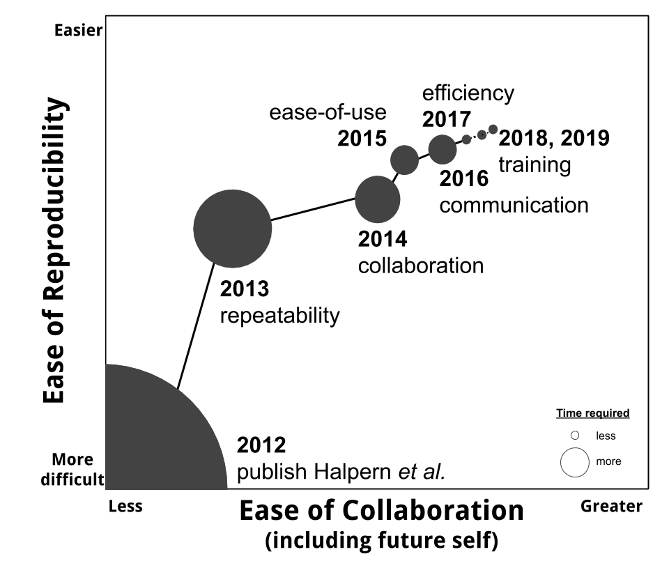

```{r setup, include=FALSE}
options(htmltools.dir.version = FALSE, warning=FALSE, message=FALSE, verbose = FALSE)
knitr::opts_chunk$set(echo = FALSE, message=FALSE, warning=FALSE)

library(xaringan)
library(fontawesome)
library(tidyverse)
table1 <- readr::read_csv("https://raw.githubusercontent.com/OHI-Science/betterscienceinlesstime/gh-pages/manuscript/table1.csv") %>%
  dplyr::select(-X1) %>%
  dplyr::mutate(Now = str_remove_all(Now, "`"), 
                `Primary open data science tools` = 
                  str_remove_all(`Primary open data science tools`, "`"))

```


class: title-slide, right, bottom
background-image: url(img/horst-starwars-rey.png)
background-size: contain
background-position: bottom left 


# `r rmarkdown::metadata$title`

### `r rmarkdown::metadata$author`
### `r rmarkdown::metadata$role`
### `r rmarkdown::metadata$institute`

[`r icon::fa("github")` jules32](http://github.com/jules32)  
[`r icon::fa("twitter")` @juliesquid](https://twitter.com/juliesquid)  
[`r icon::fa("paper-plane")` lowndes@nceas.ucsb.edu](mailto:lowndes@nceas.ucsb.edu)  
[`r icon::fa("desktop")` jules32.github.io/user-2019-keynote](http://jules32.github.io/user-2019-keynote)  


<!---TODO: change to Moz + NCEAS logos--->

???

NO UM START >> WELL

Well thank you so much, I am so excited to be here with all of you and I want to thank the organizers for this invitation. 

I'm a marine scientist and like many scientists I encountered a challenge in graduate school and am spending my career trying to solve it.

But this challenge is not about ecology or oceanography that you might expect from a marine scientist.

The challenge I'm dedicated to is helping scientists do better science in less time by creating community and learning to code. 

I've been mentoring and training scientist how to code and get started coding for 6 years now since finishing my PhD, and I'm going to share what I learned upfront:

---
class: inverse
# Lessons learned
<br>

### Open data science is a mindset
### Teamwork starts with openness / Open science starts with an open team
### Harness the power of welcome / Change requires harnessing the power of welcome 

???

The 3 lessons are

I'm going to spend the whole talk building out these lessons. 

They are the guiding principles for the program I've developed for scientists

And these principles come from my own experience as a scientist trying to work with data, struggling on my own as a graduate student and then struggling again with a team. 

But before we get to this let me start off with a bit about my experience research as a marine scientist, and what it's like for environmental scientists more broadly. 

When you see news headlines it can seem that science is a unified effort, but science really operates in pockets, with individuals working primarily within research groups, which we also call laboratories in the United States.

These research groups are often around a theme or topic, like a species, place, or method. My PhD lab was like this.


---
# Squid lab pic

???

We were a squid lab, broadly interested to understand how squid interact with ecosystems and drive economies through fisheries, and how climate change is affecting all this. 

transition: Although we had the same anchor, all of us in the lab focused on different pieces of this broader interest. 

---
# pic john field maps

???

I focused on adult behavior and migration, and how this is relevant to fisheries, conservation, and impacted by climate change

---
# pic chromatophores

???
 
others studied physiology, neuroscience, vision, and camouflage, which is really important since we have learned a lot about human neurons through studying squid neurons

---
# pic baby squid

??? 

also about development of squid babies, that are only 1 mm long when they hatch but can grow to be nearly my size in less than a year, meaning they eat a lot. 

---
# pic fieldwork

???

This meant we did a lot of work at sea and in the lab. We would go fishing and catch and release squid that we tagged with electronic tags so they would turn into little oceanographers as they swam. 

And we helped each other with our scientific work, we did field work with each other, helped keep squid alive in aquaria.

---
# Add slide? we worked together


---
# funny pic?

???

But it's not so smooth going. Because in all my education I had learned about physiology and ecology and oceanography. But I had never learned how to work responsibly with my data. 

And even though our research group would collaborate with each other with designing hypotheses and collecting data, we were eeach on our own to actually analyze our data. 

I learned how to code when all other options were exhausted. And that's because Excel was the only tool I knew, and it wouldn't work because the file was too big. 

This was not big data in the way that many of of you consider big data, but it was big to me, and it was panic-inducing. I actually considered breaking the dataset into multiple excel files and analyzing each by hand. It was a really dark time. 

transition: I got through this, and we'll talk about how. But I think I learned to code the wrong way because I did not have the right mindset, ~and beyond my mentors I was not supported~. I was resistant and intimidated, and learned in a panic, just to get the job doen, and really lonely. 

---
exclude: TRUE

<!---
So even though we are coding it is often does not result in reproducible science because first off, the author of the code isn't proud of it and doesn't want to share, and even if she does it often is riddled with hard-coded local filepaths that only work on the author's computer.


and it was because of mentorship. And I experienced it similar challenges in my next role, it was because of mentorship and community. 

--->

This whole data analysis experience can be super lonely and isolating. 

---
# openscapes grassland

???

But what I do through my mentorship program Openscapes is to help scientists like me engage with code the right way, which is with intension and community. 

---
# zoom

???

I've just completed the first cohort of environmental scientists from 7 research groups, working with the supervisor and lab members together. 

These are scientists studying global food systems, parasite ecology, and zxzxc

The very first thing we talk about is that open data science is a mindset. so let's talk about that. 

---
exclude: TRUE


???

I got through this because of a few patient mentors who helped me learn how to code. I could not have done it without them. PcFB

But even so, I learned how to code the wrong way. 
I learned how to code when all other options were exhausted. 

And that's because I couldn't use Excel because the file was too big. 

This was not big data in the way that many of of you consider big data, but it was big to me and I couldn't handle it with the tools I had. 
My data were big data to me, because they were a few thousand rows bigger than what Excel could handle. I actually considered
, it is often in a panic, and we learn and do just enough to get the job done.

<!---
My code was reproducible back when I wrote it, and when I got another squid tag back close to finishing, I could rerun. 
--->

---
class: inverse, center, middle
# Open data science is a mindset

???

A big part of Openscapes is creating welcoming entryways for scientists, and we start off by demystifying concepts.

So we'll do that here too with a few definitions

---
# data science 
 
???

From the news, it's pretty common to think that data science has a narrow defintion and means big data, AI, and machine learning.  

But AI and machine learning are not what most scientists need 


---
# data science 
hadley def
 
???

This definition of data science resonates with me.

The very first thing we talk about in Openscapes is a discipline, which means it has concepts, theory, and tools to work with data. 

And we talk about this as part that def. 

--
add R4DS hadley

???

This depiction of data science has these clear steps is the beginning of a way for scientists to see data science as something relevant to their work. And I love the emphasis on communication.

This figure has been incredibly impactful on my life. One of my biggest challenges as a scientist was that I could not abstract what were data challenges away from what were science challenges. 

That might seem like a really obvious distinction but it is something that I've struggleed with and I see others struggling with all the time. 

---
#pic on baot?

???

Because as scientists, we are on the forefront of discovery. We are asking questions that no one knows the answer to. And we have a mindset that anything we encounter is new and unchartered, and data challenges become completely interwoven into science challenges.

I spent two months trying to format dates in Matlab because since my data were from squid I thought that this was a squid challenge. I didn't have the expectation that formatting dates was something that people had encountered before.

And this is true of many environmental scientists. We don't even know what is possible, so we don't have the vocabulary or even the concepts to articulate our struggles and ask for help. 

I see this a lot when someone asks for heelp with code but they give me a 2 minute preamble to their hypothesis and study system but it turns out they want to rename columns. but can't articulate that. 

---
# pic breakfast

???

So something I tell Openscapes folks is about desayuno

So it is a big part of a mindset shift to start divorcing the science from the data and secondly to expect that the challenge is one that someone in the whole world has encountered before. 

So expecting there is a better way is a big part of this. And that is part of the mindset. 

---
# open science


???

Open science is another thing we discuss early on. This has many different definitions and even more interpretations. 

For many environmental scientists, including me as a graduate student, open science is not a positive thing. 

It means people stealing my data or misstruling my science. There are softer interpretations, where it means posting data and code publically at the end of a research study when the final manuscript is published. 

In interpreations like these, there is no benefit to the individual practicing open science. There is only cost in terms of time and risk.

So it's a lot easier to just avoid it. 

---
hampton quote
spectrum


???

I like this definition of open science

I teach that open science is a spectrum, with many entryways and paths to iteratively 

I like this too because it helps dispell the idea that you're either doing open science or you're not, and the activiation energy required to make that switch impossible task. 

Instead, what we talk about in Openscapes is how there are many entryways, and many ways to anticipate. 

Sharing a pdf of your presentation. Or using google slides. That is part of open science. 

OS spectrum. engage by sharing a talk online. create a GH org for your lab. have private repos while you get comfortable using it and working with a team with yor own data — but plan to click that button for public. That will change the way you work.

Using github, even in a private repository until you're ready to share, is part of open science because you're working with the intension of sharing.


---
# open data science

???

And open data science, what is this?


This is my current definition of open data science, which I've been modifying since I first published about it

But I'm not going to help people change their mindset and their behavior with definitions, no matter how much I've thought about word choice. 

it also means TEAM

I focus a lot on how this will save time: efficiency. but also happier
Now, seeing the benefit more, but no TIME or INCENTIVE


transition: So to get people inspired, I like to talk about this with analogies from Star Wars.

---
```{r luke}
```
class: center, middle
background-image: url(img/horst-starwars-luke.png)
background-size: contain

.footnote[
art: [@allison_horst](https://twitter.com/allison_horst)
]

???

This is Luke after he crashed his plane in the swamp on Degobah. 

He is demoralized because he cannot solve the problem before him with the skillsets and tools he has. 

transition: but what happens next is that he meets Yoda

---
```{r yoda}
```
class: center, middle
background-image: url(img/horst-starwars-yoda.png) 
background-size: contain


.footnote[
art: [@allison_horst](https://twitter.com/allison_horst)
]

???

And Yoda uses the Force to solve Luke's problem in a way he never imagined. 

This is going to open up Luke's whole world because he can learn from Yoda and not only solve his current but it will broaden his mind to what is possible in the future. 

transition: But Luke didn't go on to defeat the Empire himself, he had a whole community.

---
```{r hands} 
```
class: center, middle
background-image: url(img/horst-starwars-hands.png)  
background-size: contain


.footnote[
art: [@allison_horst](https://twitter.com/allison_horst)
]

???

The rebel alliance is powerful because of the diversity of backgrounds and expertise, and although not everyone is a Jedi, everyone contributes in really critical ways. 

transition: So just to recap this Star Wars analogy, 

---
```{r rey}
```
class: center, middle
background-image: url(img/horst-starwars-rey.png) 
background-size: contain

.footnote[
art: [@allison_horst](https://twitter.com/allison_horst)
]

???

Open data science is the Force that enables us to do better science in less time. 

And the rebel alliance is our community, everyone in this room. 

Having this community has been absolutely game-changing for me as a scientist. 

Instead of feeling stranded and deflated in a data swamp, I have a much broader and more optimistic mindset of what is possible with data, and that revolutionizes what I think is possible with science and how science can help tackle our biggest environmental challenges. 

And it is really critical that all environmental scientists feel this powerful and this supported, because for the most part they are not. 

transition: But let's talk about what it can look like for environmental science, and we can use a non-squid example

---
```{r env-only}
```
class: center, middle
background-image: url(img/horst-eco-r4ds-env-only.png) 
background-size: contain
# Make this big and center TODO, and next as well

.footnote[
<br>
<br> 
art: [@allison_horst](https://twitter.com/allison_horst)
]

???

So let's think about agriculture. There might be an ecologist who is studying the role that bees play in pollinating crops, and how drought impacts this interaction. 

To do this she might collect data on the biology, behavior, and genomics of different bee populations, and combine that with data on water availability from snowmelt and groundwater. 

So she would have a lot of different data types to make sense of, from visual observations, genetic sequences, and from sensors on the ground and from satellites. 

transition: Her findings are impactful and important to communicate to different audiences.

---
class: center, middle
background-image: url(img/horst-eco-r4ds-env-comm-only.png) 
background-size: contain

.footnote[
art: [@allison_horst](https://twitter.com/allison_horst)
]

???

Her results help inform policy and management decisions around food systems, disease transmission, sustainability, and climate change. 

She is likely working with governments at local and international scales to help inform change on the ground.

This picture here is the way science works right now. We are really good at theory, developing hypotheses, and experimental design. And we are getting better and better at communication and helping our findings get to the right audiences.

But there is this huge missing part here in the middle.

We were able to get by in the past but data challenges have gotten bigger and faster and we are not prepared. 

transition: But as we know from Star Wars, open data science and teamwork can really complete this picture here. 

---
name: environ-comm-r4ds
class: center, middle
background-image: url(img/horst-eco-r4ds.png) 
background-size: contain

.footnote[
.left[
<br>
art: [@allison_horst](https://twitter.com/allison_horst) <br>
updated from [Wickham & Grolemund](https://r4ds.had.co.nz/)
]
]

???

I know this graphic looks familiar, but notice that all of the open data science components here are ringed by communities and support. 

R really streamlines how we work with data, and also streamlines how we work with each other. 

And streamlining this process from data to communication is critical for environmental science so that we can uncover solutions for our greatest challenges. 

Making this a reality in environmental science requires changes in mindset for individual researchers and cultural change in research groups, and change for how we support scientists with data. These are all big tasks. 

But I am optimistic because I have lived through this mindset change myself, and ever since I have focused on igniting this change in individuals and teams. 

I think there is a misconception that this is not already happening because scientists aren't aware of the tools, and that telling them to use GitHub will help complete this picture here.

From my experience, that is not the whole issue. 

Yes, in a lot of cases we aren't aware that better approaches or tools exist. That was certainly me with working with dates. 

But we also aren't aware of how tools could be beneficial to us because we have never seen them in a familiar context in a way that seems relevant to us. 

And when this is the case, we do not see welcoming entry ways to engage.

This isn't just using a tool, it's changing a behavior and a mindset. It's asking scientists to invest time and emotion in a whole new way of working, and they do not have time. 

So they see the benefit more, but no TIME ~or INCENTIVE~. but that is where teamwork comes in. 


---
class: inverse, center, middle
# Teamwork starts with openness

???

A big part of openness is helping scientists identify teams and create teams and join teams. Because no one can do it all. 

And we need to shed that expectation and work together. 

---
# Teamwork
 
```{r team, out.width = '100%', fig.align='center'}
knitr::include_graphics("img/ohi-team-2018b-crop.jpeg") 
```

???

And that's teamwork.

We have been a really strong and positive team, even as people have joined and moved on to other opportunities. 

And there are s several things about being a team that have helped us be effective. 

I'm going to try to categorize things here but you'll see that there is a lot of overlap and blurred lines.


---
class: inverse
# Teamwork
<br>
# Working openly
# Leadership
# Community

???

TODO WHAT DID WE OVERCOME TEAMWISE? TELL STORIES

I'll talk about these in terms of working openly, leadership, and community.


<!---
Steph::

before you can become a team you have to feel safe. safe to fail. 
There's the people part
and there's the env part
. you can share when things aren't perfect and trust that people won't make you feel like an iditio. inclusive
people part: you hve to ave people that are willing to do that. willing to be vulnearable. It takes strength to be vlunerable. 
And you have to have people that are not afraid of change, are willing to change. willing to learn. openminded to try new ideas. aren't afraid of failing. and if you fail, share what went wrong. 
failure is such a part of openness. And a part of tearing down imposter
communication is key: talking face to face, documenting pracitces. 

one more piece: not just in yourself being vulnerable
And encouraging others is important. encouraging others to be vulnerable. Not just creating your own safe space and creating a safe space for others. 
Creating a space where others can be vulnerable too. 

leadership: vertical but also horizontal leadership and leadership from within. 
--->

---
# Working openly
a picture?


???

We work really openly with each other. We co-develop things, we share early drafts, and we are constantly giving feedback and iterating with each other. 

And that is because we feel safe with each other. 

We have established a safe space where we trust each other. 

We assume best intentions with everything we do. So critique and improvement come from the intent of making it better. 

and we are not afraid to fail, we actually share our failures and learn from them.


---
# Working openly
write these out in columns

???

Thnk about this in terms of individuals and tone they set as a team


So for individuals, this requires being comfortable with vulnerability and being willing to share things that aren't perfect. 

It also means not being afraid of change, and being willing to change and learn. 

Being open helps immensely with tearing down imposter syndrome. Internalizing that no one can do it all is increcibly liberating and one of the most productive things you can do. Everyone thinks they are imposters in different context. But you aren't; you just have different skillsets. But being honest about this helps

Setting the tone

And then for the team, it means being inclusive and welcoming 

creating not just a safe space for yourself but a space where others can be vulnerable. This is a place you can share imperfect things because sharing it It will prabbly get better. Put it out there before it's done. It's better together. No one has all the answers. 

We also greatly respect each others' time. We start and end meetings on time. try to be realistic with deadlines

transition: in terms of creating a team around open data science, seaside chats were instrumental.

---
# pic seaside chat TODO break into 2 slides

???

So the way we established this was by having regular meetings with our team to talk about data. We call these seaside chats 

<!---
Fireside chats:which served to share with the whole country into his thought process, daylighting all of his decisions and opening them up for examination. It helped bring folks on board with his decisions, helped them understand the policies that would come to affect their lives, and gave citizens the ability to provide feedback on the war they were paying for with money and lives.
--->

They are not actually by the sea, but they are informal chats that we have weekly to discuss shared workflows and teach each other what we know and what we're doing. 

In seaside chats we'll watch RStudio webinars, we'll discuss our Google Drive folder structure, we'll discuss filenaming conventions. 

We also have hackthons, where we will all drop our own projects and come together for a day or an afternoon to do something that will benefit the whole group. So this is where we will actually overhaul our filepath conventions with the here package or modernize all our code with dplyr instead of plyr. 

In seaside chats and hackathons we've also developed written protocols for onboarding new teammembers so that they can get upskilled and in our workflow as soon as possible.

---
# pic happy hour

???

And we also often have lunch and happy hours, which is evident because all of our team pictures are selfies at HH. So a shared practice of beer gardens might be part of team building for us. 

transition: So this is all critical to operating like a team and being effective with how we work. And it was ignited by really supportive leadership.

---
# Leadership — vertical

pic Ben Halpern


???

This is Ben Halpern, he's the lead of OHI and also the director of NCEAS, the ecology center where we are based. 

He set this tone for our team, and also critically, modeled a healthy work-life balance and boundaries 
He has played a huge role in our data science story because he supported us to pursue it. 

And this is really critical. He is not a coder himself but saw that we were excited about it and gave us space and trusted us to learn data science and implement standard operating procedures for our team.

He actually doesn't participate in seaside chats because he does not need additional meetings in his life but he really encouraged us to do that on our own. 

But he is super engaged in what this enables us to do, and is a huge champion for open data science at NCEAS and Univ California where we work


---
# Leadership — horizontal
```{r out.width = '80%', fig.align='center'}
knitr::include_graphics("img/shiny-conf-2016-crop.jpeg")
# knitr::include_graphics("img/tweet-juliesquid-shinydevcon2016.png")
```

.footnote[
tweet: [@juliesquid](https://twitter.com/juliesquid/status/693324555704610816)
]

???

And this kind of leadership really cultivated us becoming leaders ourselves. 

This is Ben Best, Jamie Afflerbach and I preparing for the Shiny Developers' conference in 2016.

We gained confidence teaching each other within our team, and started teaching others outside our team too. 

---
# Leadership — eco-data-science
screenshot

.footnote[
EDS link
]

???
and we started EDS, which is a skill-sharing group we started at UCSB. 

This has been really important for us to learn new things and learn how to teach,  
 And this was seen as a benefit to everyone, because the more collaborators with these skills the better for everyone. 

---
# Leadership — OHI Fellows
pic last week

???

And we also started the fellows program. These are masters students we train in data science an OHI methods and we mentor them to calculate the scores each year

eco-data-science, 
transiton: this brings us to community. And to be honest, the boundaries between team, collaborators, and community are so blurred, and I think that's a great thing. Redefining what a team is and what a community is has been one of best things about this whole process. 

---
name: runconf-shinydevcon
# Community


---
# Community
pic: Jamie tweet

???

So community starts with Twitter. 

I joined Twitter to learn R. 

And it's because my colleague Jamie encouraged me to. 

I had never used Twitter before, so I was definitely skeptical. I thought it was a megaphone for angry people. 

I didn't realize it was a place to have thoughtful conversations with lovely people, and most of all is is a way to listen and learn with others. 

So I was amazed that you could have community on Twitter 

and I was also amazed that developers were real people. And not only that, they were super nice people that made me feel welcome and valued even as I was feeling insecure about my coding skills. 

Prior to these communities I had never stopped to think that there were real people behind software. 

transition: Before R, this is the closest I'd ever come:

---
class:middle, inverse, center


<!--- --->
???

transition: Seriously, I'm not kidding.

---
# Community

.pull-left[
```{r out.width = '70%', fig.align='center'}
knitr::include_graphics("img/tweet-jafflerbach-runconf15.png") 
```

.footnote[
tweet: [@jafflerbach](https://twitter.com/jafflerbach/status/581578558977368064) 
]

]

.pull-right[
```{r out.width = '82%', fig.align='center'}
knitr::include_graphics("img/tweet-juliesquid-shinydevcon-2016.png") 
```

.footnote[
tweet: [@juliesquid](https://twitter.com/juliesquid/status/694237930991161344)
]

]

???

TWitter connected us to rOpenSci and RStudio communities and were able to meet and work with our heroes at a few conferences and unconfs. 

It was a big deal to be feel so welcomed here, it made such a difference with our skillsets and confidence. 

Being so welcomed also helped reduce imposter syndrome for me, but everyone treated me a like an important contributor that was not just based on coding abilities.

---
# pics TODO

<!---TODO maybe diff pics --->

???
 
These communities really broadened my thinking of what collaboration and teamwork meant, and I really started feeling that open data science was more than code, it was a better way to work and a better way to do science. 

This was really the defining point in my life. This is was that turning point when I really became the person I am today — that person who never stops talking about the wonders of R and data science and open science and community. 

transition: so much so that even my 3 year old niece knew about dplyr and ggplot. 

---
class: center, middle
```{r out.width = '100%'}
knitr::include_graphics("img/tweet-juliesquid-wizard.png")
# https://twitter.com/juliesquid/status/726521325821431808
```

.footnote[
tweet: [@juliesquid](https://twitter.com/juliesquid/status/726521325821431808)
]

???
transition: I had all this enthusiasm and I realized I wanted to start helping others/teach it

---
# pic carpentries twitter TODO

???

Becoming a carpentries instructor has been such a valuable thing for me. This is a group that skill-shares....

In all my education and teaching science, I have never been taught how to teach or think about how people learn. 

I've now taught 7 Carpentries workshops and we teach the workflow that we use as an OHI team

.footnote[
TODO ds-training
]


<!---

runconf15
https://twitter.com/jafflerbach/status/581159327500644352 - webappdemo by juliesquid
https://twitter.com/sckottie/status/581596645298552833 - joe raster
https://twitter.com/rOpenSci/status/582586182858465280
https://twitter.com/juliesquid/status/581637460343406593

--->

---
#rladies pic rstudioconf 2019

.footnote[

]

???

And my goodness, RLadies. This is such an amazing community and such a positive thing for all of us. 

It has also helped me reflect that I can be a stronger and more supportive ally for women in science and it's really influenced me to be bolder with how I operate in science. 

---
# pics RLADIES TODO

.pull-left[
hex
]


.pull-right[
pic us all
]


???

And we also have created an RLadies chapter in Santa Barbara

---
class: inverse
# Teamwork
<br>
# Working openly
# Leadership
# Community

???

So that's all to say that teamwork was critical to OHI's success. 

These are these intangibles that scientists don't normally talk about. 


---
# team stuffffff

Open science as a way to be more efficient and streamlined
Not an added ask at publication to share your data 
External memory (personal and collective)
Easier on/offboarding
Find solutions faster – learn to talk about your data
Build confidence – skills are transferable beyond your science
Be empathic and inclusive – grow a network of allies


---
# Closing thoughts

I've mentioned that we lack time, but we also lack instutituional support and incentives. 

I believe in this work so much but not something that is funded in the traditional structure of science. 


---
# DOODLE

the communities we're in here have grown out of the interest in the tools. but that's not the entryway for everyone. I've been focused on the reverse process, trying to create solid teams that are stronger because of ods. 


---
<br>

.pull-right[

]
.footnote[
twitter: [@openscapes](https://twitter.com/openscapes)
]

???

This past year as a Fellow with Mozilla, I've created a mentorship program called Openscapes.

Openscapes is a mentorship program, welcoming research groups to engage with open data science and become visible examples and vocal ambassadors for its awesomeness within their broader communities. 

We've just completed the pilot cohort with 7 research groups, and I'm excited to tell you all about it bc we all learned a lot and I am so proud of what they accomplished.

---
<br>

.pull-left[

]

.pull-right[

]
.footnote[
twitter: [@openscapes](https://twitter.com/openscapes), [@OHIscience](https://twitter.com/OHIscience)
]

???

But to tell the Openscapes story I need to first tell the Ocean Health Index story.

And that's because I designed Openscapes based on my experiences with The Ocean Health Index. 

Today, OHI is one of the most visible examples of how powerful open data science and teamwork can be for environmental science. 

transition: But it didn't start out that way. 

---
```{r OHI hex, out.width = '55%', fig.align='center'}
knitr::include_graphics("img/OHI-hex.png")
```

???

TODO:: After I completed my PhD, I joined the Ocean Health Index, and have been with this research group I've worked with for the past six years.  I graduated and was no longer a drad student and with a team but still found myself struggling


This is a big project where we are trying on a to better understand and quantify the health of our oceans on a global scale, 

in a way that is useful and actionable for policy. 

The OHI focuses on the benefits that the ocean provides people

<!---
"OHI is used by UN to try to quantify impacts and benefits" << that shuld be their takehome
--->

---
# pic fisheries and aquaculture

???
food

---
# pic jobs, and economies

???

jobs

---
# pic habitats and storm protection

???
storm protection

---
# tourism

???
tourism

---
# SLR CC pollution

???
And also includes pressures that act on these benefits like pollution and climate change.

transition: we model each of these and more with the best publically available data and science. 

---
# Global map

.footnote[

<br>
<br>

source: [Halpern *et al.* 2012, *Nature*]
]

???

<!---From all of this, --->

And from all that modeling we create maps like these, with scores reflecting how healthy oceans are for every coastal country around the world. 

And ever since, we have repeated this work every year so that we could understand how ocean health changes through time, and these ocean health index scores are now being used by the United Nations to help understand environmental trends.

<Jamie do we have a GIF of this?>

So the OHI and these global assessments are a really massive novel scientific and communication undertaking. And it also meant to do sound and reproducible data science.

But we did not know how. 

transition: when we first developed the OHI in 2012, we had files like these. 

---
## `Data Analysis_v2b.xls`
## `Data Analysis Explanation_v2.doc`
## `script_12_11_10.R`

.footnote[
circa 2012
]

???

We were marine scientists using the tools and approaches we had learned along the way. 

Our team was wrangling and modeling nearly 100 datasets and planned to repeat this every year in the future. 

And we truly thought that this approach would be reproducible, and were pretty deflated when it was not

---

## `re:fwd:final data updated`

.footnote[
circa 2012
]

???

TALK MORE: TODO: but this meant that MAYBE BREAK UP THE fwd
The second year we had a few new team members, and a few that had moved on. I was one of those that came on board and it meant that other team members had to forward me 


---
# Nature E&E paper (authors only no abstract)

.footnote[
source: [Lowndes *et al.* 2017, *Nature Ecology & Evolution*](https://www.nature.com/articles/s41559-017-0160)
]

???

We published our story about our path to better science in less time using open data science tools. 

It is a retrospective of how we incrementally improved our workflow over four years, using R, RStudio & and GitHub

---

```{r fig 1, out.width = '80%', fig.align='center'}

# https://docs.google.com/drawings/d/1d25T1fD9irluhQhPvNHZSt3uUBXebxqV9hFabOLZUz4/edit
```

.footnote[

<br>
<br>
source: [Lowndes *et al.* 2017](https://www.nature.com/articles/s41559-017-0160), updated
]

???

This is a figure from the paper showing how it took us less time each year to redo our work, and that it got easier to be reproducible and collaborate with others. In 2012 it took 4 years, and 20 team members. Now in 2019 it takes eight months, and 2 or 3 graduate student interns that we mentor parttime.

TODO: take more time to walk through. 

And this shows time, and time saved is money saved. 

In 2012 it took us 3M, and now in 2019 it takes 250K.

We are certainly not the first to publish about why open science and data science is important, but I think why it has really resonated with people is that we shared how hard this transition was for us. 

transition: Because we really face a reckoning with the way we worked with data. We had to admit to ourselves that the way we were working wasn't working. And we had to completely change how we worked, and it was really intimidating moving into such unknown territory. 

---
class:inverse
# Open data science

<br>

# Reproducibility
# Collaboration
# Communication
???

We share how we upgraded the way we work in terms of repro, collab, comm. 

It took us a long time to categorize our work like this because it required abstracting data science steps from our ocean health index steps. 

We had never thought about what were data challenges universally held by everyone and what were science challenges we faced with ocean health. So teasing these apart and articulating them was a big part of this story. 


TODO:: I'm not going to get into all the details but those issues I mentioned above were solved like this: 

repro: .xls --> .R
collab: fwd --> GitHub issues (simplified)
comm: static pdf --> RMarkdown-based websites

---
# Reproducibility

```{r repro, eval=require('DT'), echo=FALSE, message=FALSE, warning=FALSE}
table1 %>%
  dplyr::filter(Task %in% 
                  c("data preparation", "modeling", "version control", "organisation")) %>%
  dplyr::mutate(
    Then = "",
    Now = "",
    `Primary open data science tools` = "") %>%
  knitr::kable(format = "html")
```

.footnote[
[Lowndes *et al.* 2017](https://www.nature.com/articles/s41559-017-0160)
]

???

We thought about our path to reprocibility as data prep, modeling, version control, and organization, thought about what we did before, now, and the tools we used. 


IT TOOK US SO LONG TO SEPARATE OUT DATA WRANGLING FROM MODELING 

---
# fig: R4DS ORIG

???

And I've got to inteject here and say 

SO I CANNOT SAY ENOUGH HOW TRANSFORMATIVE THIS FIGURE WAS
I could honesttly spend the whole talk about how much this figure has CHANGED MY LIFE

---
# Reproducibility

```{r repro-complete, eval=require('DT'), echo=FALSE, message=FALSE, warning=FALSE}
table1 %>%
  dplyr::filter(Task %in% 
                  c("data preparation", "modeling", "version control", "organisation")) %>%
  knitr::kable(format = "html")
```

.footnote[
[Lowndes *et al.* 2017](https://www.nature.com/articles/s41559-017-0160)
]

???

You don't have to read through all of this, but the summary is that 

We had really been doing things by hand and with our own homegrown systems, so the biggest changes were using R and GitHub for everything, and having shared practices and conventions with the tidyverse and file storage. 

---
# Collaboration

```{r collab, eval=require('DT'), echo=FALSE, message=FALSE, warning=FALSE}
table1 %>%
  dplyr::filter(Task %in% c("coding", "workflow and project management", "internal collaboration")) %>%
   dplyr::mutate(
    Then = "",
    Now = "",
    `Primary open data science tools` = "") %>%
  knitr::kable(format = "html")

```

.footnote[
[Lowndes *et al.* 2017](https://www.nature.com/articles/s41559-017-0160)
]

???
We thought the same way about collaboration, thinking about our coding, workflows, and internal correspondance.

---
# Collaboration

```{r collab-complete, eval=require('DT'), echo=FALSE, message=FALSE, warning=FALSE}
table1 %>%
  dplyr::filter(Task %in% c("coding", "workflow and project management", "internal collaboration")) %>%
  knitr::kable(format = "html")
```

.footnote[
[Lowndes *et al.* 2017](https://www.nature.com/articles/s41559-017-0160)
]

???
Not only did shared convensions with R help our coding, but shared convensions with GitHub helped our project management and our documentation. 

Using GitHub for all of this was really helpful for onboarding new teammembers.

---
# Communication

```{r comm, eval=require('DT'), echo=FALSE, message=FALSE, warning=FALSE}
table1 %>%
  dplyr::filter(Task %in% c("sharing data", "sharing methods")) %>%
  dplyr::mutate(
    Then = "",
    Now = "",
    `Primary open data science tools` = "") %>%
  knitr::kable(format = "html")

```

.footnote[
[Lowndes *et al.* 2017](https://www.nature.com/articles/s41559-017-0160)
]

???
And finally for communication, we thought about this in terms of how we shared our data and methods. 

For scientists using traditional tools, communication is really limited to the end of a project when everything can be wrapped into a PDF and data put on a remote server somewhere.

---
# Communication

```{r comm-complete, eval=require('DT'), echo=FALSE, message=FALSE, warning=FALSE}
table1 %>%
  dplyr::filter(Task %in% c("sharing data", "sharing methods")) %>%
  knitr::kable(format = "html")

```

.footnote[
[Lowndes *et al.* 2017](https://www.nature.com/articles/s41559-017-0160)
]

???

But using R and GitHub completely changed how we think about communication and what's possible for science. 

We can do everything online. Not just all our code and data are online throughout the process, 

but RMarkdown made us become web developers and can and share things along the way, not only at the end. 

And it also enabled us to create a whole international online training program and provide tech support. 

This is a huge deal for environmental science, since there are so many different audiences involve and being able to communicate as data decisions are being made rather than only at the end is huge.

transition: so what this all looks like is

---
# Screenshots of github.com.com/ohi-science & ohi-science.org


???

I'm not going to show you everything but everything we do, from code to documentation to training books are available from these two places

---
class:middle, inverse, center
# Open source science

<!--- Others can more build off of our science because they can build directly off our code. --->

???
 
And what this all means is that we do open source science. 

It is easier for anyone to build off of our science because they can build directly off our code. 

And this is true even before it's published, while it is ongoing. 

And GitHub lets us share and distribute our code which has no comparison if you're used to forwarding pdfs to collaborators.

transition: working this way has made our initial intention and dream to become a reality, which is to have independent groups be able to lead their own OHI assessments. 

---
# OHI+ map 

???

And we have had over 20 groups using our science and our code to do OHI assessments in the places they care about. 

There is obviously much more that goes into ocean managemtent than just code, but data and code have been huge roadblocks in the past, and difficulties in sharing and distributing has led to many efforts constantly reinventing the wheel. 

We created a training program to help them understand the science and the code, and create template GitHub repos for them to organize their data and use the ohicore package.

transition:

---
# New Caledonia tweet

???

NC completed a pilot assessment in 2016 
is preparing to use OHI for monitoring, assessment, and active management of its 1.3 million square kilometer marine park

---
# Baltic

???

Here in europe, scientists in Stockholm are wrapping up its first assessment to be used for the Baltic Sea

And they, like our global work, will be repeating these assessments so that this will be a transparent and continued resource for EU's MSFD. 

---
# ohi-northeast dashboard

.footnote[
dashboard: [link!]  
original code: [Imagine Boston, who we met at RStudio::conf18]
]

???

As a final example, the OHI is part of President Obama's ocean policy for the Northeastern US.

Here Shiny dashboards have been a way to communicate with partners on the decision making process throughout the analyses.

Something else that is cool is that the code is based from XXX's, who we saw present at RStudio::conf 2018. 

---
# Fig 1 reprise

???

So I've told you about the tech advances and how we were able to reduce time and help enable others. 

transition: But there were some critital intangible things that made these massive change possible

---
class: inverse


---
name: ods-teamwork-loop
# open data science <-> teamwork doodle

???

The more I reflect on this the more I realized is that data science and teamwork exist together in a feedback loop that streamlined how we work and innovate. 

Learning and using similar software promotes and streamlines teammwork. And also working as a team better equips you to learn open practices data science.

You really need both. Trying to engage solely with open data science without teamwork can be lonely and deflating. And only as a team but without the best collaborative software can be inefficient.

transition: This is a loop that feeds back on itself. For me, and likely for a lot of us in this room, this becomes difficult to differentiate and tease apart. 

---
# hex stickers pic TODO

???

I mean, just look at our hex stickers, which are a combination of tools and communities


---
# TODO ods-teamwork-loop doodle

???

So it took our Ocean Health Index team 4 years to learn how to work as a team and use open data science tools. 

That's too long. That's too long for anyone but especially too long for our environment and climate change.

So how do we accelerate this and make it so that it isn't such a painful and long process for other labs?

transition: This is what drives Openscapes.  

---
# recap lessons learned

---
```{r openscapes-hex, out.width = '50%', fig.align='center'}
knitr::include_graphics("img/openscapes-hex.png")
```

???

With Openscapes I am trying to help other research groups adopt these practices that we have found so successful. 

Openscapes is a mentorship program for research groups to help them do better science in less time. 

I introduce these aspects of open data science and teamwork, and I do so through a program structure that Mozilla has developed and found to be really successful. 

<!---
What we realized is that both of these end points arentbeing addressed in reaserch labs and how they are connecteed wasn't discussed. So the dev and interconnectedness of both of these. And how it realtes to openscapes. Openscapes will be less painful and long for other groups.
 OPENSCAPES IS MAKING THIS WHEEL
--->

---
# Zoom
(break into a few slides)

???

It is an online mentorship program, with scientists from 7 research groups participating for 5 months.

Leaders and members from each research group participate, so we have a mix of faculty, lecturers, and program managers, along with graduate students, postdocs, techniciants, and lab managers. 

And 2x per month we get all participants from all labs together on the same call. 

This can be challenging, but it is deliberate. 

We want everyone to see and value what is possible and for them to engage and champion it in ways that align with their roles and responsibilities. 

So faculty can be most effective by supporting their teams, advocating for Carpentries workshops, and speaking up in faculty meetings about making it become official parts of the curriculum. 

Lab managers can become leaders within the lab, helping everyone become onboarded to the lab's github organization when they join the lab

And graduate students and postdocs who work with data every day can find common ground and vocabulary with data wrangling. 

And we do all research groups together because it's important to build alliances not only within labs but across them. Not only do we all learn more and it's more fun, but one of the main goals of Openscapes is to amplify our efforts nad each other so that these practices become more visible and more valued in environmental communities more broadly. 

<!---

SEtup from OHI: 

story idea: Build / structure: keep returning to this loop. The first side we want to focus on is culture and support. until we deal with this ds will be deflating. So for the frist 5 weeks we focused on the culture side of things. Now we transition from open and trusta nd honesty. Then, what are the tools we can use within that to do bsilt. These tools and these communities. We realized this awesome loop exists that adccelerates our science and our quality of life. If that's what Openscapes is based on, keep returning to it. How do these interact with each other. Explain the loop that this creates for labs. How openscapse closes this into a cohesive loop
THose things can't exist separately if you want to succesfful lab, it makes everyone more happy labs operate as teams, makes it more reproducble happier

--->

<!---
*****They want to know the lessons learned. **** more imp than details. 
CUT WORDS. a few high-impact sentences on each lessons learned.
--->

---
# todo pic: ods-teamwork-loop

???

This is not about hands-on training or coding, but indstead about creating a culture of teamwork and an expectation that there are better ways to work, and pathways to improvement. 

The first half of the program we focus on teamwork and culture within the research group, and in the second half we transitioned to the open data science tools that enable better science in less time.


So for teamwork, we focus on creating supportive leadership in a data science and digital context, helping research groups become teams, and helping them discover and engage with online communities and participate in and start local communnities. 

---
# Michelle quote from seaside chats/twitter

???
It was really exciting to see this culture change start to happen within research groups

---
name: summit
background-image: url(img/openscapes-summit.jpg)  
background-size: contain

.footnote[
link to blog
]

???
Also able to strengthen community across labs. 

We were able to bring the faculty and lecturers together in person and I was surprised what an effect that had on the second half of the program. 

Up to them they had understood that all of this was powerful and they knew I was really excited about it, but they left the summit actually feeling it for themselves. 

---
# Malin quote

### This isn’t just about coding and GitHub, this is about changing how we do science — Malin Pinsky (Pinsky Lab)

???


---
# open science <-> teamwork doodle

???

And in the second half we focused more on data science tools and how to learn them with communities. 

This is where we learned about some of the packages in the tidyverse and rOpenSci suites. We talked about how RLadies, #tidytuesday, and Mozilla study groups are really imporant ways to learn

The point is to see what is possible and discuss how it fits in with their ongoing work and really help create these mindset and culture shifts

---
# PATHWAY
(knitr table like above, or screenshot of google slide?)

???

One of the centering features goes back to the pathway idea from the tables I showed, and had teams think about the tools and approaches they were using now, and what they might want to do differently. 

We revised these throughout the program, and helped set priorities for which things to focus on first.

---
# Outcomes


???
I'm cutting this for the practice talk to check on timing and how much I should get into this 


---
class: inverse, middle, center
# Lessons learned 

<!---
Steph notes Jul 2:

How imporatnt env science is to other things. Ag and health. And that's where you need to be open and inclusive and welcoming. Beause everyone thinks of themselves as imposters in different context. But they aren't they just have different skillsets. 
Maybe fits into the mindset: willing to be need to become  comfortable with putting yourself out there and your work out there before it's perfect. It will prabbly get better. Put it out there before it's done. It's better together. No one has all the answers. 

Assume best intentions. Critique and improvement come from the intent of making it better. Not because you're an imposter.

Walk the walk. This isn't the most perfect talk but i've made these decisions. People connect with me when I do that.

willing to put things out there even when they're not perfect. 

--->


<br>

???

So throughout all of this, I have three lessons learned. 

These come through my experiences as a PhD student studying squid, through six years with the Ocean Health Index team and this R community, and with my most recent year with Mozilla and Openscapes. 

They are guiding principles for me, and what I advise for environmental scientists. But they are relevant much more broadly so I hope they will be useful for everyone here as as well. 

---
# Open data science is a mindset 
<!---
```{r yoda, out.width = '75%', fig.align='center'}
knitr::include_graphics("img/horst-starwars-yoda.png")
```
--->
???
The first is that open data science is a mindset. 

Yes, it is also tools and practices for data analysis and reproducibility. 

But it is also an expectation that there is a better way to work, 

and it is confidence and willingness to figure it out and innovate. 

It's how the Force was not only a skillset but it broadened Luke's mind of what was possible and the scope of challenges he could tackle. 

<!---
How imporatnt env science is to other things. Ag and health. 
Maybe fits into the mindset: willing to be need to become  comfortable with putting yourself out there and your work out there before it's perfect. It will prabbly get better. Put it out there before it's done. It's better together. No one has all the answers. 
--->


<!---
Steph::

before you can become a team you have to feel safe. safe to fail. 
There's the people part
and there's the env part
. you can share when things aren't perfect and trust that people won't make you feel like an iditio. inclusive
people part: you hve to ave people that are willing to do that. willing to be vulnearable. It takes strength to be vlunerable. 
And you have to have people that are not afraid of change, are willing to change. willing to learn. openminded to try new ideas. aren't afraid of failing. and if you fail, share what went wrong. 
failure is such a part of openness. And a part of tearing down imposter
communication is key: talking face to face, documenting pracitces. 

one more piece: not just in yourself being vulnerable
And encouraging others is important. encouraging others to be vulnerable. Not just creating your own safe space and creating a safe space for others. 
Creating a space where others can be vulnerable too. 

How to get rid of cruft: write a POP for my presentation. Make sure that everything leads back to my POP

--->

---
# Teamwork starts with/needs openness
<!---
```{r hands, out.width = '60%', fig.align='center'}
knitr::include_graphics("img/horst-starwars-hands.png")
```
--->


.pull-left[
## description
### trust & vulnerability
### open mind & willingness
### leadership 
]

???

--

.pull-right[
## strategies
### seaside chats
### hackathons
### code of conduct
]

???

It takes strength to be vulnerable. 

<!---

Teamwork starts with future you and future us. 

This is about thinking ahead for what will make your analytical life better, but also the analytical life of your team. 

This means creating work environments where everyone feels comfortable and are supported to do their best work. Codes of Conduct can play a big role in this.  

This means having good leadership and room to grow as leaders 

This means creating trust and shared norms, and it takes time. But particularly 


Teamwork is really important for science and discovery. But it's also powerful for people. Mental health, leaky pipeline, burnout. and maybe include this too. This is really powerful for science and individuals and teams. 
--->

---
# Harness the power of welcome 


???

And lastly, leverage the power of welcome. 

This means being a friendly face and encouragement for others, and thinking about where they are coming from.

be open and inclusive and welcoming. Beause everyone thinks of themselves as imposters in different context. But they aren't they just have different skillsets. 

<!---
I have realized that researchers who are doing amazing env science might be really intimidated by data science and they might need to be welcomed. 
--->

I learned this early from the folks at rOpenSci and RStudio with their commitment to creating a diverse and inclusive space. 

And it has been a big part of my experience and education with Mozilla, and a foundational part of Openscapes.

---
# openscapes

so openscapes hasn't solved all of these issues yet 

→ could also frame positiviely: i haven’t solved all of open science, even in the first openscapes champions here are some struggles that I had trouble advising and I want to figure out to do better and help mentor better. If others are in this boat we could frame together. 
Could say: I’m really interested in talking with people of how to move this forward. Diff from “you need to support me”
If i’m talking about future challenges: how you find funding to support this kind of mentorship that is not part of how scientific resaerch tends to get funded. It’s a systemic weakness. It’s not me specifically unfunded. It’s systemcie
It is hard to find funding to support thes initiaitves


---
# wrap up 

What’s been challenging and what we’re still working on as a more collaborative community.

---
#squid closure
Now I’m doing this presentation at an R conference, in R. What I was able to overcome and what I could do. 
Need closure to “this was really hard and I didn’t know anything”. 


---
class: inverse
# Lessons learned & strategies
<br>

# Open data science is a mindset
# Teamwork starts with/needs openness
# Harnass the power of welcome 

???

These things fuel what it means to work responsibly and collaboratively 

and should also fuel what it means to be a scientist. 

---
```{r welcome-rstats, out.width = '75%', fig.align='center'}
knitr::include_graphics("img/horst-welcome_to_rstats_twitter.png")
```

.footnote[
art: [@allison_horst](https://twitter.com/allison_horst)   
tweet: 
]

???

And the awesome thing is that we all have our part. 

a critical thing is that anyone can step up and be a leader. 

And the easiest/fastest way is to welcome and encourage others with open data science and teamwork.

And if you yourself are unsure you have a team or feel like you're on the outside of the feedback loop or on the threshold, know that since you're here so you're already part of it. 


ENDING: so we can all think about this in our own situations and also think of how we can support environmental scienists...

in a time when env sci is our most pressing probs are related to env it's critical that those scientits have the tools and team to answer those quiestions using data.

<!--- Memorize this and tempo. And what I'm offering as part of the solution. 

One of final slides
"this is powerful for science" >>> it's part of this for science. but it's also powerful for people. mental health, leaky pipeline, burnout. and maybe include this too. This is really powerful for science and individuals and teams. 

--->


<!---
challenges ops?

biggest challenges:
- labs dont think like teams
- pis feel they should leearn first

big ops
- talk to colleagues

comes back to making this more visiblee so can be more valued

how do you set up good practices for the lab when you do not know those practices yourself? And if you don't have time to learn, and they're always changing? 
- I feel it. Need help with databases. 


Obstacles
And there are obstacles, the primary being time, especially when this investmentis not evaluated or rewarded broadly in the academic structure in regards to promotion and job security. 

And there are opps but challenges as teams. how do you lead well when you dont know?
--->

---
# Thank you

TODO repeat title slide with more info?  
Oooo or do a hack title slide adn screenshot full contain here boom.

(screenshot <https://twitter.com/nceas/status/1137388818989047814>?)

.pull-left[
title
link to slides
twitter handles
]

.pull-right[
Teamwork in action:
OHI team, Mozilla team  
all artwork: [@allison_horst]  
xaringan theme: [@apreshill]
]

???

I want to end by saying thank you to this community for so many things, but particurly to its leadership in creating a diverse and inclusive space. I have learned so much about the importance of diverse and inclusive spaces, and this is an area that I in particular want to help extend these aspects of our culture to the environmental science community, and well beyond. 

Thank you.

