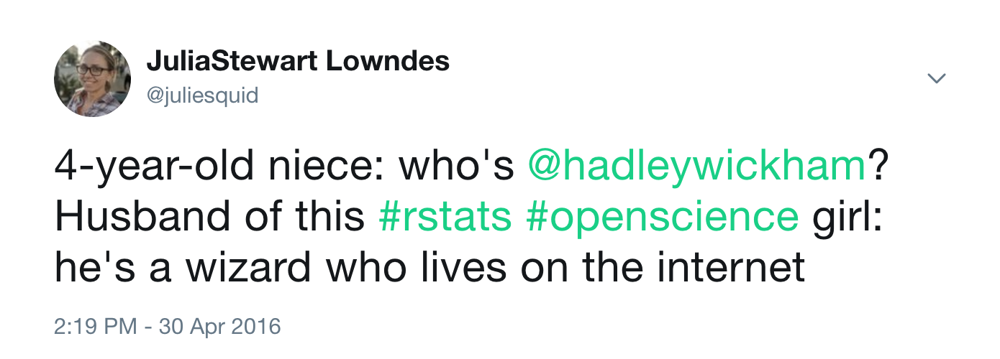

```{r setup, include=FALSE}
options(htmltools.dir.version = FALSE, warning=FALSE, message=FALSE, verbose = FALSE)

library(xaringan)
library(fontawesome)
```

<!---TODO: change to Moz + NCEAS logos--->
.footnote[

]

??? 

Well thank you so much, it is so amazing to be here with all of you and I want to thank the organizers for this invitation. 


<!---
KEEP IN MIND

Environmental scientist doing research. "How can we bring this to science" is way too big
When I say science = = "bring #rstats to science" what does that mean
"when I say bring to science the level I'm talking about is here" 


TOO MANY WORDS> the most important things get lost if each is a full paragraph

each slide is 2-3 sentences. percision of speech. every word should be throughful and precise. to create emphasis of tihngs


instead of saying "i've been thinking a lot about" "the question I ask: how can we bring this ethos to env sci". That's been guiding my efforts

add one sentence: environmental problems are critical. what a bummer what they don't 

R has changed my life, and so much that now I'm actively working to have it to change the lives of more scientists like me.

this is my work, I'm neck-deep if I am asking the question if this is ncessarry? The answer is no every time.

Notes BH & JA & MF, Brisbane: 
Need to anchor beginning

"let me tell you a story about"
first part was too abstract for too long
Keep the flow. it's good. But start with a specific story. 

Quick drop into environmental science

"a lot of we" in the intro. Tell a person's story. Christie?

The community that R is a part of. We are from finance and science and developers!!! Community of Jedis Put faces

Ignore this: not many jedis, elite. Not eeveryone? But in the world of R everyone can be a jedi? Have a resonse

What I liked is that our story has been received well. Maybe to start with it. This is not a unique story, it resonates throughout communities. 

"our story, which we have told" we've told our story and it has resonated resoundedly. Say "our story" rather than "our publication"

I mentioned data layers but didn't say data needs
Show our maps: maps are important for showing spatial things for communication
Cornwall website things: tell a story about Cornwell. Why are they doing this? In Cornwall they are having issues with overfishing

The fact that I'm goinving a talk aobout an R conf and never talked abou tthis at an ocean conf speaks to the imporatnce. 

5 10 years ago I never would have been here giving this. How powerful this community has

I instead of we

Putting names and faces. Jamie introduced me to R

Show Michelle Stuart.

My personal story 

My whole thing is a bout team. A big part of this is about my personal transoforamation but it's really about the team. So my  story is the team story. 

Ending::: need a super summary to bring back to my main message: teams and openness. End with the profound single statement. 
Now that you've heard all of this you can see how teams are so important. But need to end with core message

You can do open science without being part of a team so this is something I am trying to work at. Core message. Visual


It's not about fixing problems it's about making something good even bnetter

Right now we're doing good science but it's talking longer, more people, this is a way to make more accessible. 

Nature 2012 had a huge impact. But now accelerated impact. But the fact that we do it better now doesn't mean it wasn't good science the first time, it's just better and faster now. 

Data challenges have gotten bigger. And tools are here to ameiliarte. In the past the tools weren't even necessary. Didn't have asatellites. NOw we are seeing . Everything is happening faster. Need tools to meet these challenges. Until fairly recently haven't been available for the normal humans to use. Everything has changed, we need to get with the program. 

I never really emphaize that we repeat our science. It's often not repeated by the people who did it. Will resonate with finance that 

I talk about those 3 labs in the end. Start with them and weave through to give stories throughotes. WOrk the story around those labs. That will connect the audience. 

R for better science in less time
then part of the intro is about deconstructing
it's not that the science we do now is bad, it's better because it's faster, more open, streamlined, inclusive. 

--->

???

NO UM START What's my starting word? WELL or SO <3 mins>

I'm a marine ecologist and 5 years ago I never would have imagined I would be here, at useR!, much less giving a keynote talk. So since this is a foreign concept to me, it must be for you as well, and I wanteed to 

<!---My story quickly becomes a team story--->

---
# pic: swimming with dolpins

???

I thought I would start off both reinforce and demistify what you think a marine ecologist does

---
# intertidal pic

???

My undergraduate education was about understanding the complexity of marine ecosystems. 

I learned about marine plants and animals that live at the boundary of land and sea, and how they have evolved to survive underwater and in in crashing waves as well in air and sun. 

---
# tides, currents, island pic?

???

and global processes like tides, currents, geology, and how that affects the species that live there

---
# SLR CC

???
as sea level rise, and climate change. <!---speciation <darwin finches>,--->

---
# Scuba pic

And since you're wondering, yes, my education also included scuba diving and doing research in beautiful places. 

???

---
# deep sea pic

???

When I was a PhD student my education was more targeted around my research questions. I learned about how species live in the deep sea, surviving within pressure and darkness of kilometers of water above them. 

---
# Squid fisheries

???

I also learned more about where calamari comes from, in terms of squid ecology, fisheries, and policy 

I was in a research group that we call a laboratory or a lab where we all studied squids, interested to understand how they interact ecosystems and drive economies through fisheries. But with vastly different questions —

---
# JField map

???

I was interested in behavior and migration, fisheries, and conservation 

---
# hannah pic

???

others studied physiology, neuroscience, vision, and camouflage, 

---
# danna pic

and also about development of early hatchlings that are only 1 mm long. 

---
# boat pic

???

We helped each other with our science: with field work, keeping animals alive in seawater tanks in the lab, and outreach <S4K>. 

---
# screenshot JSL matrix for loops 

But data analysis was something that we had to figure out on our own, and it wasn't pretty. I learned MatLab in a complete panic when 2 years into my PhD when I finally had my own data, I couldn't even open it in Excel, the only analytical tool I knew.

It was a demoralizing experience, to say the least. 

Figuring it out alone created stress and shame and imposture syndrome because I thought I was the only one who wasn't prepared. It wasted time and slowed down my research — I literally spent 3 months trying to convert date format, with zero expectation that this was a problem somebody had encountered before. With my mindset at the time I could not separate this data problem from my scientific research, which truly no one had ever done before.

And this has all been to set the stage that:

---
class: center, middle
# R and data science have incredible potential accelerate scientific research

<!--- no text on slides till now ---> 
???

Data science and teamwork have incredible potential accelerate scientific research. <!---FAST ---> They can help uncover solutions to our most pressing problems, which in the environmental space where I work include food security and sustainable resource use on land and in the oceans.


--
# But many environmental scientists are being excluded from this potential  

???

But many environmental scientists are being excluded from this potential. 


we are wrapped into our science. 
--
# We lack a supportive scientific culture and opportunities to learn

???

We lack opportunities to learn data science and we lack a scientific culture that supports us to incorporate it into our research. 

My experience, and the experience of my other lab members, is typical. And not just for marine biologists, but for ecologists, evolutionary biologists, and all sister domains that can fit into environmental science. 

It is not even a part of our culture to talk about data practices, which makes teamwork and collaboration more difficult since we do not have the mindset or really even the vocabulary to do so.

transition:: But I know that we can change this —

---
# But R can help

???

And we can do it following the example of this R community here. 

We are here from academia, finance, software development, pharma, non profits, and our community has really focused on creating a positive space for people to be welcomed as human beings first, and encouraged and supported as coders. 

This makes the R community such a powerful team for innovation and collaboration, and I think this is exactly what environmental science needs.

---
# Changes in mindset and culture

???

Creating a true cultural change in environmental science will require mindest shifts in individuals — 

And I know this is possible because I have lived through this mindset change myself, and I have spent the last 6 years igniting cultural change in environmental science by working with colleagues around the world. 

It can be really intimidating to engage in data science and learn to code, especially when we also do not see examples of its benefits in our own context, and we are not aware of welcoming entry points to engage. 

<!---
We are scientists that are passionate about our work, and well-trained in our scientific domains. But we pretty immediately realize that we don't have the tools or skillsets to work responsibly with my data. 

Most of us do end up coding to some degree. But it is something we resist as long as we can before learning just enough to get the job done at the last moment, usually in a total panic. 
--->

transition: we all love analogies here and the one I like to use here is from Star Wars

---
# Luke 


It is the most demoralizing thing to be stranded with a challenge ahead of you that you can't solve with the skillsets you have — especially when you've heard there is something powerful but you don't know where to start 
???

<!---
Does it sound better like this: 
We have all felt like Luke does here, when we are/feel stranded, looking at a challenge that we cannot solve with the skillsets we have. It is demoralizing and leads to desperate attempts 

--->

This is Luke after he crashed his plane in the swamp on Degobah. 

He is there staring at a challenge that he cannot solve with the skillsets he has. 

It is super demoralizing, and he has no idea how to even begin this process. 

Imagine for a moment if he had tried to rig up some pullees and levers. 

It would not have been pretty. Or reproducible. It wouldn't be something he was proud of and he wouldn't have wanted anyone to know about. And, he wouldn't have learned much to prepare for any upcoming challenges.

transition: but what happens next is that he meets Yoda 

---
# Yoda

???

And Yoda has a skillset to solve  Luke's problem in a way he never imagined: he uses the Force. 

And Luke can learn from Yoda, and he will develop skills to not only solve this problem, but it will open his mind to what is possible and the challenges he can take on. 

transition: But the Force alone didn't make Luke successful, it is the community that he is a part of. 

---
# Hands

???

Luke works with a team that is not only Jedis that have the same skillsets he does. This community/movement made up of diverse people that have different backgrounds and expertise, and all of them contribute in really important ways. 

So the Force is R or what I talk about as open data science, which includes open practices and teamwork. And the community is us, the people in this room. 

transition: And we can help welcome more environmental scientists into this community because this is what environmental science should feel like.

Having this R community has been so impactful for me as a scientist. Instead of feeling stranded in a swamp like I have several times in my scientific career, I feel more powerful than I ever imagined. 

You here in this room have helped me change the way I do science and the way I think about what is possible. You have empowered me and helped me build confidence that translates well beyond code. 

transition: So we'll come back to star Wars, but now let's come back to this planet and talk about what it's like to be an environmental scientist.

If I think about what it's like to be a marine ecologist or an environmental scientist more broadly, this is the state of things. 

---
# Horst environment

???

Environmental scientists have a lot in common with the open source community because we are working for the public good, and passionate about our work. 

<!---
Environmental science is actually not a distinct discipline, but a collective term used to describe science interface of ecology and people/society.

--->

ADD THIS::: Data challenges have gotten bigger. And tools are here to ameiliarte. In the past the tools weren't even necessary. Didn't have asatellites. NOw we are seeing . Everything is happening faster. Need tools to meet these challenges. Until fairly recently haven't been available for the normal humans to use. Everything has changed, we need to get with the program. 

We are deeply interdisciplinary, because our research questions require us to become experts in the many different domains we work in. 

To have a "terrestrial" example as marine biologists would say — 

A ecologist studying how pollinators affect agriculture crops might also need to understand the biology, behavior, and genomics of different bee populations, as well as local and regional patterns of water availabity through rain, snowmelt, and drought. 

transition: And our resulting findings are really impactful for society.

---
# Horst environment & comms

???

Our findings help understand food systems, disease transmission, and climate change. And this means that communicating and collaborating with many different people is critical. We are often working with governments at local and international scales to help inform change on the ground.

As you can see, environmental scientists are doing critical work addressing problems, but there is this gap here in their skillsets that can cause delays when we have no time to waste.

<!---
So we work in different domains but something that unifies us is that we collect and work with a lot of data. 

transition: But since we often rig up our analyses the way Luke would have, and this means we're not really proud of our code, which means we are less inclined to talk about it, and resistant to sharing it. And this perpetuates the culture of not talking about data and coding, and therefore not valuing it. 

--->

transition: we are doing really good work but we need to be better. 

---
# Horst complete

???

But that's why I think data science and teamwork can really complete this picture here. 

R streamlines how we work with data, and also streamlines how we work with each other. 

So with I want to do is not only welcome more environmental scientists to the R community, I want to simultaneously extend our values and our ethos to environmental science so that scientists can work more streamlined as a team.

transition: So over the past year with my Mozilla Fellowship, I've been trying to do this through a program I've developed called Openscapes.

---
# (outline slide)
.pull-right[Openscapes hex

- mentorship program for research groups
- create more visible examples & champions for open data science
- just completed pilot cohort!
]

???

With Openscapes I'm focusing on building this culture at the core community unit of science, the research group or laboratory. 

In environmental science, labs often have a common theme, which can be a species like my PhD lab and had with squid, or it can be a technique like population genetics, or a location like the Galapagos.

Openscapes is a mentorship program for these labs, helping them engage with open data science and become visible examples and vocal champions for open data science within their broader communities. 

We've just completed the pilot cohort of this mentoring program with 7 research groups, and I'm excited to tell you all about it bc I am so proud of what they accomplished.

--
.pull-left[OHI hex

- example of data science & teamwork
- R is game-changing for communication & culture
]

???

But to tell the Openscapes story I need to first tell the Ocean Health Index story. 

And that's because I designed Openscapes based on what we experienced with the Ocean Health Index, because it is an example of how powerful data science and teamwork can be for environmental science. 

R not only made it easier do analyses better, but also has been game-changing for us as a team to broaden our minds to what is possible in science and its impact. 

It really has been like the Force, broadening our minds to what is possible for science. 

And that has particularly been evident for efficiently collaborating, sharing and communicating our work while it is ongoing rather than only post-publication has been really critical for us bridging science and policy. 

transition: so let's talk about the Ocean Health Index

---
# OHI hex, bigger centered

???

The motivation behind OHI is that governments, non-profit groups, and scientists wanted a way to quantify ocean health and measure changes in ocean health through time so that policy could respond in a more holistic way to the things we care about. 

Indicators are a powerful way to do this, although traditionally, oceans have been managed for single things, like a single fishery or a single pollution type. 

OHI set out in 2008 to be a comprehensive indicator with best available science and data. Its focus was on the benefits humans get from oceans but also include impacts on oceans like pollution and climate change. 

---
# pic fisheries and aquaculture

???
food

---
# pic tourism, jobs, and economies

---
# pic habitats and storm protection

---
# tourism

---
# SLR CC pollution

<!---
OHI context: people were trying to understand how to measure ocane health
indicators are poweful way
ways to explain the niche it was filling
pretty pictures of the ocean. it spices up a talk. TED style. Beautiful. Use our human connection to the environment. Slowly pics pass go by . Try to understand how benifitting and impacting oceans in a quatnfifiable way. 
--->

transition: 

---
# Nature 2012 screenshot? 

Halpern et al. 2012

???

We first released it in 2012 and it was really well received. 

Along with developing the method for combining these elements together, we also used the method to assess oceans globally. 

That means we scored how healthy oceans are for every coastal country around the world using nearly 100 publically available data sets. 

<!---, and we repeat this every year to track change through time. --->

---

So it is a really ambitious project. 

We set out to be the best approach for data-driven marine policy around the world, and to repeat this global analysis every year. And indeed now it is used by the United Nations and also by twenty government and university groups. 

transition: We did NOT set out to be the best approach for what open data science could look like in environmental science —


---
# Nature E&E paper (authors only no abstract)

???

But we realized we had a story to tell about our how these open data science enabled us do better science in less time.

This story is a retrospective of how we incrementally improved our workflow over four years. 

It tells and how R & and GitHub helped change the culture of our science, because it made our work faster and better, and also helped us turn our methods open source so that others could use and build from them. 

And what was unique about this story was that we also shared about hard this transition was for us. 

transition: In those 4 years we had had a reckoning with the way we worked with data, and we had to completely change the way we had always worked and seen other people work. 

---
# Data Analysis_v2.xls
Data Analysis Explanation.doc
data_12_11_12.R
model.sh
re:fwd:final data updated
Final Report.pdf

circa 2012

???

This is just a sampling of how we had been working to do this study with 100 data sets. 

This was back in 2012, when we had 30 scientists and analysts collaborating this way, and we truly thought that this would be reproducible. 

We knew that we ourselves would be redoing this whole effort the next year, and we had gone out of our way to write down what we had done in word documents to accompany excel files and R scripts.

So it was also really deflating and embarassing that it was not easy for even us to reproduce.

And we had deadlines and pressures to keep, so doing anything different seemed really unattainable, like getting that plane out of the swamp.  

transition: but we obviously did improve, so let me tell you up front how we did it

---
# 1. We were a team (pic of us?)
2. team lead valued & supported us (pic of halpern)
3. someone jazzed about R (pic of best?)

???

There are a couple of key things about this transition for us. 

The first is that we thought of ourselves as a team. This seems simple but it was a big deal. We trusted each other and were willing to learn from each other, and teach each other. We were willing to talk about the tools we were using and move towards all working with a common set of tools. 

The second and really importantly we had a team lead who saw value in us investing time and resources

A third thing is that we had someone on our team that was really jazzed about R. And he was willing to patiently teach us R and GitHub together as a team.

---
# summary: people made the difference 

1. We were a team
2. team lead valued & supported us
3. someone jazzed about R

???

So for this first year we were focused on easing into these tools. For me I was still only using R and GitHub in a pretty narrow sense, for coding and sharing code. 

It was definitely making my analytical life better but it hadn't completely changed my my life yet.

transition: But then 2 important things happened:

<!---
All of us had GH accounts, even BH

Our collegue Ben, the one who was jazzed about R, was using Shiny and devtools and had a vision of where this could take us but I personally was still pretty narrowminded about R, partly due to my own skillset that narrowed my mindset. 

--->

---
# Twitter

???

First, we joined Twitter. My colleague Jamie

I had never used Twitter before, so I was definitely skeptical. I thought it was a megaphone, I didn't realize it was a place to have thoughtful conversations with people, and most of all is is a way to listen and learn and connect with others. 

On Twitter I was amazed that I could learn from and interact with coders and developers. 

We learned about things like dplyr and devtools that were in the works, and also started getting comfortable looking to github to install packages.

I was really blown away that developers were real people, and real people that were super nice and that we could talk with. 

Prior to this I had never imagined that there were real people behind software. 

transition: Honestly, in all of my previous experience, the closest I'd come to a real person behind software was this guy

---
class:middle, inverse, center


<!--- --->
???

transition: But it turns out, R developers are way more awesome than Clippy. 

---
# pic of us with Hadley & Joe

???

The second thing that was really transformative for me is we went to the rOpenSci unconf and met Karthik and Joe and Hadley and Winston and other folks in person.

It was a big deal to be feel so welcomed here, and it really broadened my thinking of what community is and what teamwork is. 

I really started feeling that this was more than code, it was a better way to work and a better way to do science. 

this was really the defining point in my life. This is was that turning point when I really became the person I am today — that person who never stops talking about R and data science and open science and community. 

transition: so much so that even my 3 year old niece knew about dplyr and ggplot. 

---

```{r out.width = '50%'}

# https://twitter.com/juliesquid/status/726521325821431808
```

---
# Fig 1

???

All of this really revolutionized OHI. We were able to do better science in less time, and feel good about it. 

We repeat our global study each year, ... Use statistics: 3Mill to 250K. 20 team to 2 intersns. Def include these stats.

It didn't happen all at once; like all scientists we had a lot going on and time spent learning to code took away from other tasks. But soon we started getting that time back, and could invest it in other things. 

---
# ohicore package (screenshots)
R projects & GitHub repos

???

Our OHI team felt really empowered. And all of this was reflected in our work. 

Everyone on our team used GitHub to share and discuss ideas, even if they were not coding. 

For our analyses we were working with a common set of tools, set up systems for organizing and naming files. We started doing spatial analysis in R,

This helped us think in the same way together. 

transition: and this is when R really changed the game for science communication. 

---
# ohi-science.org

???

This is the website that we launched in 2016 that we made with Jekyll, and it now seems crazy that we didn't always have it a central place to share all our methods with this project. 

It started off as a simple one pager, where we could put pdfs for partners to download. Now it has so much more, it's a central hub for anyone wanting to learn more information about how we do those OHI for all countries globally — 

transition: and also it's a place where folks can learn how to do their own. 

---
# OHI+ map? (maybe just points)? (CI logo?)

???

I mentioned that over 20 groups are using the OHI to assess ocean health in their own waters around the world. 

We were able to help them learn how to do this with resources on the website, but also by creating GitHub repos for them that contained all of our code and data as a starting point for them. 

GitHub lets us distribute and share with collaborators in a way that was never possible before, and I teach and help troubleshoot through github. It's been so streamlined. 

transition: part of this also involved generating simple RMarkdown websites for them so that they can communicate about their work with their own stakeholders. 

---
# OHI Cornwall
ohirepos::deploy_website(repo_registry, push = TRUE) 

indonesia just led the world of the oceans, 
and cornwall is expecting this to be a bit part of the EU.

???

These simple RMarkdown websites have been SO valuable for us. 


They have turned us into web developers. We can auto-generate them for any country, we probably have 30 of them that we've made, including for the global assessments that are used by the United Nations. 

---
# ohi-global website 

???

transition: RMarkdown has really changed the game for us for communicating with our partners and groups. These simple websites help us organize and present data, but also —

---
# ohi-northeast dashboard

???
We are also using shiny in a few ways, and this is one of the coolest examples. 

We are leading OHI Northeast, and it is actually included in part of President Obama's ocean plan, and this has been a way to communicate with partners on the decision making process throughout the analyses.

Something else that is cool is that the code is based from XXX's, who we saw present at RStudio::conf 2018. 

---
# toolbox-training

???

We've also been using Bookdown so much — It's turned us into authors. This book is still in the works, but it is to help people us our OHI package and workflow

---
# data-science-training
(animate with screenshots from SWC events?)

???

And this is one we wrote to teach people our workflow so that they can work with #rstats and Github like we do.

I became a Carpentries instructor to learn how to better teach others how to learn R and GitHub, and made this book built off of some of those lessons and Jenny Bryan's Stat 545

---
# eco-data-science
RLadies

???

WE ALL BECAME LEADERS. So not just BH. All of us. 

We also started leading local communities too, both at the University where we are based and within the broader community

<!---
# Issues
Screenshots from Openscapes slides =  aweomsone OHI stuff, 
tweets

--->

---
# Box 1 & 2 excerpts

???

And in the paper we also share resources for what helped us learn. This includes R4DS and Stat 545, but also NSSD 
Also, recommendataions for how to get started. 

This has also helped with onboarding new team members onto our team.

---
# Team
Pics: HH with fellows, BB-Jamie-me laughing, pier with Erich & Eva
(does this fit here? not sure)

???
So here we are; 

We've come a long way. 

Now, we are still repeating that assessment each year, but to do so we actually started a fellowship program for graduate student interns: we train them in data science and how our team works and they lead the assessment. 

---
# Nature paper reprise

???

Additionally, our story has been really well received. 

By sharing our story we have become an example of how how open data science can be game-changing for science, particularly in environmental science.  

Like I said, OHI is used by 20 groups around the world, and will be included in the UN's ocean indicators for the Sustainable Development Goals. 

And it has also been influential in the environmental science community more broadly. 

But it does not fully hit the mark for kick-starting everyone to engage. I've gotten feedback that it still feels unachievable to people and excludes people who don't feel like they were part of a team. 

transition: so I have reflected a lot about this and —

---
# open data science <-> teamwork doodle

???

A main thing I've realized is that data science and teamwork exist together in a feedback loop. 

Learning and using similar software promotes and streamlines teammwork. And also working as a team better equips you to learn data science.

This is a loop that feeds back on itself. For me, and likely for a lot of us in this room, this becomes difficult to differentiate and tease apart. Why is is that we work efficiently together? It becomes both team culture and data science tools that streamline how we work. 

transition: so it's what we're talking about here

---
# Star Wars hands

???

with the force and the rebel alliance 

transition: and here

---
# horst R4DS and communities

??? 

with how data science can weave into science. 

---
# open data science <-> teamwork doodle

???

But what if you are currently outside of this loop? 

What are the entryways to get into it?

<!---transition: I think back to how intimidated I was to coding and the idea of open science, and how life-changing it has been for me. And the most important part was being welcomed and supported. 
--->


---
# Openscapes hex, center

???

This is the main focus of Openscapes: to help scientists find welcoming entryways to this data science — teamwork loop. 

Particicularly interested in leadership. To have targeted impact and help accelerate this cycle. 

goal is to complement existing efforts like the Carpentries, RStudio, rOpenSci and help welcome more scientists to them.


---
# Openscapes recipe

1. team lead valued & supported us
2. We were a team 
3. someone jazzed about R 


???

I designed Openscapes to recreate what was so critical to us with OHI. It needs a supportive team lead, a team, and entry ways to get jazzed about R and open data science. 

---
# Openscapes recipe
(animate this)

1. team lead valued & supported us > faculty, lecturers, program managers
2. We were a team
3. someone jazzed about R

??

And to have the most targeted impact, I'm focusing on team leads who are already doing impactful science and are leaders in their disciplines. 

The idea is that if these scientists who already have influence can also be role models and champions for data science, we can create ripples throughout science and change the culture as a whole. 

---
# Openscapes recipe
(animate this)

1. team lead valued & supported us > faculty, lecturers, program managers
2. We were a team > laboratories, research groups
3. someone jazzed about R

??

And with Openscapes I'm not just focused on mentoring individuals but whole teams. I mentor the teams that already exist in science: the laboratory, just like my PhD lab that focused around squid.

---
# Openscapes recipe
(animate this)

1. team lead valued & supported us > faculty, lecturers, program managers
2. We were a team > laboratories, research groups
3. someone jazzed about R > Openscapes lesson series

???

And to help ignite change, we use the Openscapes lesson series. It's a course I've developed and piloted earlier this year. 

transition: so let me show you what this looks like

---
# First Openscapes Champions Cohort

???

This is the first cohort of Champions!

They are 7 faculty and lecturers. Picked for 3 reasons. 

<!---
I work with the leads and lab members together, and am in a way trying to recreate what we have with our OHI team, where the team lead values it and enables it, and the team is really jazzed about what is possible and has agency and paths forward. 
--->

---
# Zoom cohort tiled 
{r out.width = '50%'}
knitr::include_graphics("img/zoom-cohort.png")

???
And these are the labs. 

<!---

The idea is that scientists are doing good science, but how do we make it better? How do you welcome them into that loop, empower them with what is possible, and amplify their successes within their communities?

I'm interested in how these labs can do better science in less time and champion this within their own communities, ultimately increasing the visibility and value of data science and teamwork within environmental science. 

--->

---
# Series

???

What we teach in the series

For the most part, *not* teaching hands on. More of a "meet and greet" to communities like rOpenSci, RLadies, Carpentries, RStudio. 

The point is to see what is possible and discuss how it fits in with their ongoing work and really help create these mindset and culture shifts

The first half is really focused on team culture: we talk about Codes of Conduct, on developing a mindset for sharing and shared practices within the lab, in a data science context. So we talked about what onboarding looks like from a data science perspective. 

We did interweave data science here too, to facilitate team work: we set up lab GitHub organizations as and talked about using GitHub issues and markdown as way to record ideas.

And in the second half we focused more on data science tools and how to learn them with communities. 

This is where we learned about some of the packages in the tidyverse and rOpenSci suites. We talked about how RLadies, #tidytuesday, and Mozilla study groups are really imporant ways to learn

But throughout, the point was to have time and space each month to exposed to and empowered by what was possible, and to have some accountability in trying to integrate it into workflows, no matter where everyone and individuals as well as labs, were starting from. 

Bookdown.

Let me say too that I've been developing the lesson series in bookdown — this will become a textbook for Openscapes although I've got a lot of work to do.

But I'm writing this book not to be specific at all to environmental science: it is discipline agnostic, ready to be used for other groups too. But this kind of community work is real work, and we need this valued and supported more too. 

Twitter is a part of this: teach how to engage but also how to amplify

---
# Structure

5-month remote course, also piloting on-demand workshops for teams. 

Each month I meet one-on-one with the lab lead, 

And also each month we meet twice with all lab leads together, plus their lab members. 

These calls are 1.5 hour and in them I try to teach only 30 minutes, so that the maximum time can be discussion of how this could work within each lab context.

We have discussions as a group and also use a feature in this video conferencing software that lets us do breakout rooms so that we can discuss in smaller groups and mix up the labs. 

ALSO SCREENSHOTS OF GOOGLE DOCS
<!---And each one ends with some hands-on "efficiency tips" --->

---
# Openscapes recipe
(animate this)

1. team lead valued & supported us > faculty, lecturers, program managers > enable it
2. We were a team > laboratories, research groups > have agency to do it
3. someone jazzed about R > Openscapes lesson series > have pathways forward

???
The purpose for these cohort calls is so everyone learns and sees the value and power of what's possible, and that the leads feel comfortable letting their labs develop these skillsets, and the lab members have agency and paths forward for what to do 

So through this process, everyone is really starting to value it as individuals and as labs. But making this more visible to broader networks is critical as well, 

---
class: center, middle, inverse
# Accomplishments & momentum

---
# Wood Lab
ecology of parasites in marine and freshwater ecosystems

???

This is the Wood lab, they study ecology of parasites in marine and freshwater ecosystems
quote

When I asked Chelsea to be a part of Openscapes, she essentially told me that open science and data science wouldn't be useful to her lab, but that she was willing to participate since I was asking her to. She thought that open science meant sharing data at the end of a project along with publication, and had no sense that it was a bigger spectrum of tools and practices that were actually designed to make science better the whole way through, and not just add extra work at the end of a project. 

---
# Chelsea quote

???

Chelsea is now an ardent supporter of open science and data science. She and Danielle, who also participated, have gotten the lab up and running with GitHub, and are sharing course materials online. 

They have gotten the whole lab up and running on GH, including undergraduates and collaborators across labs. 

transition: 

---
# Pinsky lab
global change ecology and evolution in the sea

???
This is the Pinsky Lab, they study global change ecology and evolution in the sea. They are doing really high impact work using population genomics and modeling, and have a lot of people in the lab who code or use GitHub as individuals. 

The biggest change for this lab was really feeling like a team and establishing shared tools and workflows for the team. When I first interviewed Malin about Openscapes, I asked how lab members shared data and code and methods with him. He said that depending on the person, information was shared through Dropbox, Google Drive, GitHub, email attachment, or thumb drive. This helped frame the 

Michelle Stuart is actually here at this conference, because of Openscapes. She is leading change in the Pinksy lab, leading their Seaside Chats and creating a Lab Cookbook after creating a GitHub account for the first time. 

And she and has just started the first RLadies chapter in New Jersey

---
# Horst Lab
stats & data analysis for environmental science grad students

???
This is the Horst Lab, they teach stats & data analysis for environmental science grad students

Allison has upgraded her stats course to now teach the tidyverse and GitHub. She has also shared all her courses online and created a website — and something that is awesome is that Michelle who I just mentioned is going to be leading a new course at Rutgers using these lessons herself.

They have also started a weekly in-person coding club for #tidytuesday

transition: that has been something really exciting to see more broadly: 

---
# Across labs 

???

How there have been these connections across labs. In addition to the Pinsky Lab using Allison Horst's materials, it turned out there were 3 labs working on different angles of aquaculture, and they will be writing a grant together. 

transition: so these are just a few examples, and we've made a lot of progress towards having this become part of the culture in these labs, and seeding beyond.


---
class: center, middle, inverse
# Lessons Learned

---
# Lesson 1: Team building is important

???
This is something I realized early on: that didn't think of themselves like teams

Labs were not necessarily thinking of themselves as a team so much as a collection of individuals doing their own thing. 

It's like everyone is operating like Luke Skywalker did, even when they are sitting next to each other in a lab and working on similar themes.

That was certainly the case for me in my PhD laboratory, but I hadn't really realized that that was being carried forward into young labs led by my generation of scientists. But they have never seen anything different or seen how data science tools could enable and strengthen teamwork.

Seaside chats for homework.

transition: This includes mentors giving space and promoting mentees

---
# Adrian tweet about Sam

???
But it is also a chance to show how they can amplify each other, and how that is particularly important as team leads and mentors. 


---
# Lesson 2. Cohort building is important

???

Mozilla Open Leaders knows this

Summit

---
# Halley and Chelsea tweet

???

---
# Amplifying to networks is important

???
on Twitter and IRL

---
# Halley rnoaa tweet

???
And also amplify data science within their networks.

---
# Chelsea quote — I'm making my colleagues
Adrian quote — I say we're doing our students a disservice

???
They are also amplifying this in their communities, through grad student committees, faculty meetings. They are learning to amplify how important this is


---
# Outstanding questions

???
Some good questions that have arisen are

- how do you set up good practices for the lab when you do not know those practices yourself? And if you don't have time to learn, and they're always changing? 


<!---
This isn't just about me amplifying the awesome accomplishments they have made, but I certainly do that. 
--->

---
# data science <-> teamwork

???

These labs are now in this feedback loop: they have the aspect of open tools and data science and the aspect of community. and we want this to be both. 

transition: but there is still a long ways to go until —

---
# horst complete fig

???
until we really operate like this. 

And I do think that Openscapes is an important way to help ignite this change, and I am so proud of what we accomplished. And I will be continuing to lead these online cohorts, and also lead short-form workshops with teams on the ground. So I'm really excited about it.

But truly, Openscapes is not the long-term solution. Scientists should not be learning this on their own time through pockets of opportunity. 

What we really need to make this picture complete is to value this enough in environmental science that it becomes part of formal education, that we hire and compensate excellent environmental data scientists to teach these at the university, and that these practices become part of the evaluation process for what it means to be a scientist. We need to value all of these things in environmental science more. 

transtion: And beyond, in other scientific fields, and beyond. 

---
# So what can we all do — Rey

Openscapes is one way I'm trying to help people find teams when they don't exist. 

Not everyone has a defined team around them, or maybe they don't realize they have them and need to engage but also they might now. 

Maybe need to realize what you have. What if you don't. We all have a team but don't realize it. How to buildt
RLadies. 

---
# At first it was like, but now it's like 
horst illustration?

???

but also it can be intimidating, and that people's entry ways can be different from yours, or you might have forgotten what it was like when you learned.

---
# Power of Welcome
horst welcome to #rstats illustration

<!---
In the last section, don't assume have a team. Build up a story or message about how to find your team.
--->

???
So what can we all do as individuals? 

I do think that it's all about the power of Welcome, as Stef Butland puts it. 

I think back to how intimidated I was to coding and the idea of open science, and how life-changing it has been for me. And the most important part was being welcomed and supported. 

I think we all can do our part to become leaders and champions for these practices in our own worlds, and welcoming more people to have this mindset. 

We need to extend the ethos of this R community to our faculty meetings, our board meetings, or project updates, etc. Managers employees/senior developers

We can advocating for opportunities to learn, which in academia means courses and dedicated lecturers to teach them. 

And if you yourself feel like you're on the outside of the feedback loop or on the threshold of this Welcome know that since you're here you're here so you're already part of it. 

<!---
Talk about and show your colleagues how R makes you 

- a data scientist, but also
- an author
- a web designer
- a designer
- an inspired and supported community member
- and a community leader

--->

<!---
Have question marks in a table! I don't know how to fix this

- don't have time or support. I really see Openscapes treating the symptom not the problem: we need this taught more. Allison Horst has one of the few positions that I know, and it was on her own initiative that she turned this course from a largely theoretical stats course for environmental scientists to a hands-on data science course where she now teaches the tidyverse and GitHub.

--->

---
# Thank you for this inclusive culture

(screenshot <https://twitter.com/nceas/status/1137388818989047814>?)

???

I want to end by saying thank you to this community for so many things, but particurly to its leadership in creating a diverse and inclusive space. I have learned so much about the importance of diverse and inclusive spaces, and this is an area that I in particular want to help extend these aspects of our culture to the environmental science community, and well beyond. 

Thank you.

---
# Thank you

link to slides
twitter handles


<!---


# /#rstats
Hands w/ logos: RStudio, rOpenSci, RLadies, Carpentries, Mozilla


???

Our #rstats community is so amazing. 

It is welcoming, it is inclusive, it is supportive, it is empowering. 

There is such a mix of people from diverse backgrounds and experiences, from all over the world, online and in person, innovating and learning together. 

What's different about our community is that we put people first and are really here to share ideas and learn together. 

We are all here because we have been empowered by R as a tool and a community, but we can all probably think of others that are still feeling stranded and alone. We might work with them day-to-day. 

transition: So my question is 
--->
---
# Fig 1 & team stuff
<!---

???

This is our team!

NEED TO INTRO OHI+ A BIT
ref Lowndes et al. 2015
spinoff architecture 

--->

<!---
# Figure 1, but just axes and whole bubbles

???

This illustration conveys how repeating our work each year takes less time, and got easier on the collaboration and reproducibility fronts. 

---
# Fig 1, now with text 

This has freed up our time to work on improving documentation and training, along with improving the science as better data and methods were available. 

I joined the team in 2013, the first year we were going to recalculate scores with an additional year of data. And this 2013 circle is not as small as you would imagine it would be if repeating our work from the previous year involved hitting go on a bunch of scripts. 

transition: And that's because in 2013 we were working the way we always had as marine ecologists — and we thought we were being reproducible.

---
# data_analysis_v2.xls
data_12_11_12.R
re:fwd:final data updated

???

Our story starts off here, in 2013. 

I know this looks painful but we had been doing data processing in whatever way we had all learned on our own previously. Most was in excel and a bit in R, with decisions documented in accompanying Word documents and emails. 

So then the year I started when we went to repeat the analysis, there was a lot of forensics and detective work to uncover what we had even done the first time, much less figuring out how to repeat it. 

*[What strikes me about this now is that these ways we had all been working had gotten us far, our team had PhDs and masters degrees and are now working at a really prestigious center. So these homegrown ways got us far for a little while as individuals, but they did not work as a team. ]*

Needless to say, we needed a better system. So here is what we do now. And again, this was over a four-year period, and we continue to iterate and improve. 

---
# Actually being reproducible 

TOO much GitHub (esp with IT.)
Instead, show a few examples of ways that we use to use R for comm. 
NO BULLETS.
that we can generate for each country. 
Maybe just the word "simple RMd websites"

Work on no "and" transistions with bullets.
We had a boss even thought they weren't using R, gave us space. 
Maybe numbers are less tedius "next", "second"

Slide where I say "Box 1 and Box 2". if you don't expect people to read it, dont put it here. There's a of info here b ut whe I want you to know
Box 1 is relataed to ds skills and workflow and Box 2 is the culture and comm
OTHERWISE DON"T PUT THEM IN THERE.
if you want people to realize NSSD> it then you have to point it out
Some of our resources are the NSSD podcasts and nontraditional resources for building our skills and community. 

Maybe just include part of [Table 1](https://www.nature.com/articles/s41559-017-0160/tables/1)? 

(maybe bullet this, and animate?)

.pull-left[
GitHub norms

- create a GitHub organization, admin privileges
  - everyone makes an account, including non-coding team members
- private "issues" repo for discussing methods
  - institutional memory, onboarding & offboarding
- use RStudio & GitHub (version control)
]

.pull-right[R norms

- all data prep, models, viz in R
- coding norms: `tidyverse` & friends
- separate core functions into R package `ohicore`
- separate local "tailorable" models into separate repos 
- data prep narratives in R Markdown
]

???
So now we have a team workflow that I think of is a simplified GitHub workflow. We have a GH org and everyone has an account, and everyone has admin privileges. 

---
# Communication header

.pull-left[GitHub

- sharing & distribution
- troubleshooting/IT
- publishing

]

.pull-right[R

- single webpages (e.g. supplemental materials)
- ohi-science.org website (Jekyll) 
- assessment websites (simple RMarkdown)
- documentation (RMarkdown)
- training books (bookdown)
- shiny apps
]


--->

---
# original porrige ramble

All of this has had me thinking about how software enables teamwork and teamwork enables software. I'm going to try talking about this here; I have trouble articulating it but think it is really critical for moving forward. 

So thinking about it from the software side, there is software that is designed to streamline teamwork. So for example, Google Docs lets you co-edit and therefore co-think together in real time. GitHub helps you collaborate with others. And there are also things like the tidyverse that help create shared social norms that make it easier to work as a team. 

On the other side, if you are on a team or community you might have more courage to engage in new software; RLadies chapters, meetup groups, #tidytuesday

So for a lot of us in this room, this turns into a feedback loop and get almost difficult to differentiate and tease apart. so it might be less of a loop but more like a porridge...

And OHI is an example where one person with knowledge of the software enabled the team to engage, which meant more of us were using the software, which then strengthened the team norms and culture. 

And eco-data-science starts at the other side maybe, where it was a group of friends asking one person with knowledge of R how to learn, so it went from the team to the software and then 

But the reason I'm thinking about this is because of entry points. What if you are outside of this loop. You might use software, but not really with any collaboration or teamwork in mind. Maybe you don't even feel like you're part of a team. 

How do you engage and welcome people in those cases? 

transition: thinking about this was a big part of how I designed Openscapes. Really wanted to focus on how software can streamline teamwork and teams can learn how to use software.

