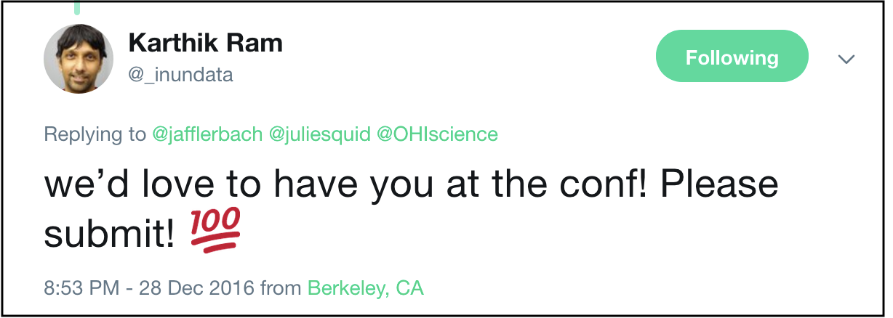

```{r setup, include=FALSE}
options(htmltools.dir.version = FALSE, warning=FALSE, message=FALSE, verbose = FALSE)
knitr::opts_chunk$set(echo = FALSE, message=FALSE, warning=FALSE)

library(xaringan)
library(fontawesome)
library(tidyverse)
table1 <- readr::read_csv("https://raw.githubusercontent.com/OHI-Science/betterscienceinlesstime/gh-pages/manuscript/table1.csv") %>%
  dplyr::select(-X1) %>%
  dplyr::mutate(Now = str_remove_all(Now, "`"), 
                `Primary open data science tools` = 
                  str_remove_all(`Primary open data science tools`, "`"))

```


class: title-slide, right, bottom
background-image: url(img/horst-starwars-rey.png)
background-size: contain
background-position: bottom left 


# `r rmarkdown::metadata$title`

### `r rmarkdown::metadata$author`
### `r rmarkdown::metadata$role`
### `r rmarkdown::metadata$institute`

[`r icon::fa("twitter")` @juliesquid](https://twitter.com/juliesquid)  
[`r icon::fa("paper-plane")` lowndes@nceas.ucsb.edu](mailto:lowndes@nceas.ucsb.edu)  
[`r icon::fa("desktop")` jules32.github.io/user-2019-keynote](http://jules32.github.io/user-2019-keynote)  


<!---TODO: change to Moz + NCEAS logos--->

???

NO UM START >> WELL

TODO LANG

Well thank you so much, I am so excited to be here with all of you and I want to thank the organizers for this invitation. 

I'm a marine scientist and like many scientists I encountered a challenge in graduate school and am spending my career trying to solve it.

But this challenge is not about ecology or oceanography that you might expect from a marine scientist.

The challenge I'm dedicated to is helping scientists do better science in less time by creating community and learning to code. 

I've been mentoring and training scientist how to code and get started coding for 6 years now since finishing my PhD, and I'm going to share what I learned upfront:

///

These come through my experiences as a PhD student studying squid, through six years with the Ocean Health Index team and this R community, and with my most recent year with Mozilla and Openscapes. 

They are guiding principles for me, and what I advise for environmental scientists. But they are relevant much more broadly so I hope they will be useful for everyone here as as well. 


---
class: inverse
# Lessons learned  
<br>

### Open data science is a mindset
### Teamwork starts with openness 
### Harness the power of welcome 

???

TODO LANG

The 3 lessons are


I'm going to spend the whole talk building out these lessons. 

They are the guiding principles for the program I've developed for scientists

And these principles come from my own experience as a scientist trying to work with data, struggling on my own as a graduate student and then struggling again with a team. 

But before we get to this let me start off with a bit about my experience research as a marine scientist, and what it's like for environmental scientists more broadly. 

When you see news headlines it can seem that science is a unified effort, but science really operates in pockets, with individuals working primarily within research groups, which we also call laboratories in the United States.

These research groups are often around a theme or topic, like a species, place, or method. My PhD lab was like this.


---
class: center, middle
# Kraken
.pull-left[
```{r sq-lab, out.width = '80%'}
knitr::include_graphics("img/")  
```
]

.pull-right[
<br>
<br>
<br>
```{r sq-lab2, out.width = '100%'}
knitr::include_graphics("img/") 
```
]

.footnote[
TODO links
]
  
???

TODO LANG

We were a squid lab. We studied how squid swim, how they grow, what they eat, and the impacts they have on ecosystems and economies. 

These books share some of our work.

transition: Although we had the same anchor, all of us in the lab focused on different pieces of this broader interest. 

---
class: center, middle
.pull-left[
```{r sq-tag, out.width = '80%', fig.align='center'}
knitr::include_graphics("img/*IMG_9254_small_byGregAuger.jpg")  
```
]

.pull-right[
```{r sq-tag2, out.width = '80%', fig.align='center'}
knitr::include_graphics("img/*JulieReleaseAugerIMG_9311.jpg")
# *JulieReleaseAugerIMG_9397.jpg # release to water
# *IMG_9268.JPG # measure
```
]

.footnote[
photos: Greg Auger
]

???

My research was about the behavior and migration of adult Humboldt squid, which can be nearly as big as I am.

That is me on the right, releasing a squid back into the ocean with an electronic tag that turns it into a little oceanographer as it swam. 

---

<br>

.pull-left[
```{r fieldwork, out.width = '80%', fig.align='center'}
knitr::include_graphics("img/sq-ctd-fieldwork.JPG")  
```
]

.pull-right[
<br>
<br>
```{r fieldwork2, out.width = '100%', fig.align='center'}
knitr::include_graphics("img/DannaJulieAshleyNOAA.JPG") 
```
]

.footnote[
web: [Gilly Lab](https://gillylab.stanford.edu/)
]

???

Our research required a lot of teamwork, both at sea and in the laboratory. 

We would help each other develop hypotheses and collect data, and would work together to interpret results. 

In short, we were a typical research group that collaborated around the science. 

---
# But, the data. JENNY

???

But in terms of analyzing data, we were each on our own.

This was a struggle for me. In all my education I had learned about biology and ecology and oceanography and squid camouflage and locomotion. But I had never learned how to work responsibly with data. 

---
# But. 
<br>

.pull-left[
## I was:
### Not comfortable with computers
### Intimidated by coding
### No clear paths to learn JENNY
]

???
I was not comfortable with computers; they had never been a part of my education as a scientist. 

I was intimidated by coding because every movie I'd ever seen had a computer with scrolling green text on black that intended to make you feel like you could never understand it

And I saw no clear paths to learn. 

I learned how to code when all other options were exhausted. 

---
# But. 

.pull-left[
## I was:
### Not comfortable with computers
### Intimidated by coding
### No clear paths to learn JENNY
]

.pull-right[
## I learned to code: 
### In a panic
### Just to get the job done
### With nested for loops that would take your breath away
]

.footnote[
book that got me through grad school: [Practical computing for biologists](http://practicalcomputing.org/)
]

???

And my data challenges were because of big data. Not big data in the way that many of you might think of it, but it was big to me, and it was panic-inducing. 

To avoid coding I actually considered breaking the dataset into multiple excel files and analyzing each by hand. 

The only reason I got through this was from patient mentorship from some amazing colleagues, who donated months of their own time to help.  

Needless to say, this is not the way it should be for scientists. 

transition: And I like to talk about it how it should be with analogies from Star Wars.

---
```{r luke}
```
class: center, middle
background-image: url(img/horst-starwars-luke.png)
background-size: contain

.footnote[
art: [@allison_horst](https://twitter.com/allison_horst)
]

???

This is Luke after he crashed his plane in the swamp on Degobah. 

He is demoralized because he cannot solve the problem before him with the skillsets and tools he has. 

transition: but what happens next is that he meets Yoda

---
class: top, center
```{r yoda, out.width = '88%'}
knitr::include_graphics("img/horst-starwars-yoda.png") 
```

.footnote[
art: [@allison_horst](https://twitter.com/allison_horst)
]

???

And Yoda uses the Force to solve Luke's problem in a way he never imagined. 

This is going to open up Luke's whole world because he can learn from Yoda and not only solve his current but it will broaden his mind to what is possible in the future. 

transition: But Luke didn't go on to defeat the Empire himself, he had a whole community.

---
```{r hands} 
```
class: center, middle
background-image: url(img/horst-starwars-hands.png)  
background-size: contain


.footnote[
art: [@allison_horst](https://twitter.com/allison_horst)
]

???

The rebel alliance is powerful because of the diversity of backgrounds and expertise, and although not everyone is a Jedi, everyone contributes in really critical ways. 

transition: So just to recap this Star Wars analogy, 

---
```{r rey}
```
class: center, middle
background-image: url(img/horst-starwars-rey.png) 
background-size: contain

.footnote[
art: [@allison_horst](https://twitter.com/allison_horst)
]

???

TODO LANG 

Open data science is the Force that enables us to do better science in less time. 

And the rebel alliance is our community, everyone in this room. 

Having this community has been absolutely game-changing for me as a scientist. 

Instead of feeling stranded and deflated in a data swamp, I have a much broader and more optimistic mindset of what is possible with data, and that revolutionizes what I think is possible with science and how science can help tackle our biggest environmental challenges. 

>>>>I actually did not find how powerful open data science was until I finished graduate school and became part of the team with the OHI. 

And it is really critical that all environmental scientists feel this powerful and this supported, because for the most part they are not. 

So ever since I felt this way I've been helping others engage too. 

transition: Some of the ways I've been doing this is through joining global communities and creating local groups on the ground in California

---
# Carpentries workshops

.pull-left[
```{r swc-xhoi, out.width = '100%', fig.align='center'}
knitr::include_graphics("img/swc-whoi-2018b.jpg") 
```
]

.pull-right[
```{r swc-mbari, out.width = '100%', fig.align='center'}
knitr::include_graphics("img/swc-mbari.jpg")
```
]

<!---
others:
https://twitter.com/jafflerbach/status/936371169107746816 mbari
https://twitter.com/jafflerbach/status/721006698937225216 ucsb
--->

.footnote[
TODO links
]


???

I became an instructor with the Carpentries, which is a group that leads workshops for data science skillbuilding. 

These are hands-on coding workshops, and I've now led 7 of them on 3 continents

---
# Eco-data-science
screenshot: jamie teaching? swc-ucsb?

.footnote[
EDS link
]

???

Eco-data-science, which is a coding club or study group that we started at UCSB. 

And then we started teaching our friends one-on-one and in small groups, and that's led to EDS being a 250-member group at UCSB. 

---
# RLadies TODO ADD LOGOS

<br>

.pull-left[
<br>
```{r rladies, out.width = '100%', fig.align='center'}
knitr::include_graphics("img/rladies-rstudioconf19-jdlong.jpg")  
```
 
.footnote[
web: [rladies.org](https://rladies.org/), 
photo: [JD Long](https://twitter.com/CMastication/status/1101568109423542273)
]

]

.pull-right[
```{r rladiessb, out.width = '100%', fig.align='center'}
knitr::include_graphics("img/rladiessb-kickoff2019.jpg")
# rladies-kickoff.jpg
```
.footnote[
tweet: [@RLadiesSB](https://twitter.com/RLadiesSB/status/1088825797085880320)
]

]

<!---[@i_steves](https://twitter.com/i_steves/status/983909123073835010)--->


???

R-Ladies is a global organization with local meetup chapters around the world, for gender minorities who do/want to do programming in R.

It has also helped me reflect that I can be a stronger and more supportive ally for women in science and it's really influenced me to be bolder with how I operate in science. 


https://twitter.com/jafflerbach/status/1106360972510289921
 rladiessb kickoff
https://twitter.com/JennyBryan/status/1068755043061571585 reprex

---
# TODO OHI

<br>

.pull-left[
<br>
```{r ohiplus, out.width = '100%', fig.align='center'}
knitr::include_graphics("img/")  # samoa
```
 
.footnote[
here
]

]

.pull-right[
```{r ohifellows, out.width = '100%', fig.align='center'}
knitr::include_graphics("img/fellows")
```
.footnote[
web: [ohi-science fellows](http://ohi-science.org/ohi-global/fellows.html)
]

]

---
# Nature E&E paper (authors only no abstract)

.footnote[
source: [Lowndes *et al.* 2017, *Nature Ecology & Evolution*](https://www.nature.com/articles/s41559-017-0160)
]

???

We published our story about our path to better science in less time using open data science tools. 

It is a retrospective of how we incrementally improved our workflow over four years, using R, RStudio & and GitHub

And since we published this and from all of these expereiences I've been thinking about /pinch points JENNY/ are in environmental science to identify where I can be most effective.

And this led me to spend the last year as a Fellow with Mozilla

---
# MOZILLA FELLOWS TODO mozilla logo
.pull-left[
<br>
<br>
```{r moz, out.width = '100%', fig.align='center'}
knitr::include_graphics("img/")  
```

]
.pull-right[
```{r moz2, out.width = '80%', fig.align='center'}
knitr::include_graphics("img/") 
```

]

???

You probably know Mozilla from the Firefox browser, but that's just one part of what they do. Their mission is to keep the internet a place for good. So they focus on privacy and securotu, misinfo, and open science. Which is where I come in. 

I spent my time as a Mozilla Fellows developing a program called Openscapes and leading a pilot cohort with 7 research groups.


---
# Openscapes  

???

Openscapes is an open data science mentorship program for research groups.

It complements existing efforts like the Carpentries and addresses one of the biggest chllenges I've seen which is how to establish and maintain shared practices as a team.

The purpose is for research groups to see and value what is possible and for them to engage and champion it in ways that align with their existing roles and responsibilities. 

So I've been listening to the Openscapes participatns and trying to understand how they work and where are good places to ignite change. 

transition: TODO So I'll walk us through this now with a general example. 

<!---
THAT'S IT DON"T DEFINE THE STRUCTURE.

I've just completed the first cohort of environmental scientists from 7 research groups, working with the supervisor and lab members together. 

So faculty can be most effective by supporting their teams, advocating for Carpentries workshops, and speaking up in faculty meetings about making it become official parts of the curriculum. 

Lab managers can become leaders within the lab, helping everyone become onboarded to the lab's github organization when they join the lab

And graduate students and postdocs who work with data every day can find common ground and vocabulary with data wrangling. 

And we do all research groups together because it's important to build alliances not only within labs but across them. Not only do we all learn more and it's more fun, but one of the main goals of Openscapes is to amplify our efforts nad each other so that these practices become more visible and more valued in environmental communities more broadly. 

--->


---
```{r env-only}
```
class: center, middle
background-image: url(img/horst-eco-r4ds-env-only.png) 
background-size: contain
# Make this big and center TODO, and next as well

.footnote[
<br>
<br> 
art: [@allison_horst](https://twitter.com/allison_horst)
]

???

So let's think about agriculture. There might be an ecologist who is studying the role that pollinators play in crop production, and what the impacts of drought are. 

To do this she might collect data on the biology, behavior, and genomics of different bee populations, and combine that with data on water availability from snowmelt and groundwater.

So she would have a lot of different data types to make sense of, from visual observations, genetic sequences, and from sensors on the ground and from satellites. 

transition: Her results help inform policy and management decisions —

---
```{r env-comm}
```
class: center, middle
background-image: url(img/horst-eco-r4ds-env-comm-only.png) 
background-size: contain

.footnote[
art: [@allison_horst](https://twitter.com/allison_horst)
]

???

around food systems, disease transmission, sustainability, and climate change. 

This picture here is the way science works right now, and what our education looks like. 

It's how our squid reasearch group worked. 

We are really good at theory, developing hypotheses, and experimental design. And we are getting better and better at communication and helping our findings get to the right audiences.

But there is this huge missing part here in the middle.

In the past, we have managed as individuals creating our own homegrown approaches and not talking about it like it was a critical part of science.

But this approach is not working now: our data challenges have gotten bigger and faster and we are not prepared. 

transition: But as we saw from Star Wars, open data science and teamwork can really complete this picture here. 

---
```{r env-r4ds}
```
name: environ-comm-r4ds
class: center, middle
background-image: url(img/horst-eco-r4ds.png) 
background-size: contain

.footnote[
.left[
<br>
art: [@allison_horst](https://twitter.com/allison_horst) <br>
updated from [Wickham & Grolemund](https://r4ds.had.co.nz/)
]
]

???

TODO LANG

Because R streamlines how we work with data, and also streamlines how we work with each other. 

I know this graphic looks familiar, but notice that all of the open data science components here are ringed by communities and support. 

And streamlining this process from data to communication is critical for environmental science so that we can uncover solutions for our greatest challenges. 

AND WHAT I'VE SEEN IS THAT THIS IS NOT ONLY ABOUT SKILLS, IT'S ABOUT MINDSET.

Making this a reality in environmental science requires changes in mindset for individual researchers and cultural change in research groups, and change for how we support scientists with data. These are all big tasks. 

But I am optimistic because I have lived through this mindset change myself, and ever since I have focused on igniting this change in individuals and teams. 

I think there is a misconception that this is not already happening because scientists aren't aware of the tools, and that telling them to use GitHub will help complete this picture here.

From my experience, that is not the whole issue. 

Yes, in a lot of cases we aren't aware that better approaches or tools exist. That was certainly me with working with dates. 

But we also aren't aware of how tools could be beneficial to us because we have never seen them in a familiar context in a way that seems relevant to us. 

And when this is the case, we do not see welcoming entry ways to engage.

This isn't just using a tool, it's changing a behavior and a mindset. It's asking scientists to invest time and emotion in a whole new way of working, and they do not have time. 

So they see the benefit more, but no TIME ~or INCENTIVE~. but that is where teamwork comes in. 


---
exclude: TRUE

transition: I got through this, and we'll talk about how. But I think I learned to code the wrong way because I did not have the right mindset, ~and beyond my mentors I was not supported~. I was resistant and intimidated, and learned in a panic, just to get the job doen, and really lonely. 

<!---
So even though we are coding it is often does not result in reproducible science because first off, the author of the code isn't proud of it and doesn't want to share, and even if she does it often is riddled with hard-coded local filepaths that only work on the author's computer.


and it was because of mentorship. And I experienced it similar challenges in my next role, it was because of mentorship and community. 

--->

This whole data analysis experience can be super lonely and isolating. 

---
class: inverse
# Lessons learned  
<br>

### Open data science is a mindset
### Teamwork starts with openness 
### Harness the power of welcome 


---
class: inverse, center, middle
# Open data science is a mindset

### data science • open science • open data science 

???

This is the first thing I talk with with the Openscapes participants. 

What is data science, what is open science, what is open data science, and how are they relevant and beneficial and worth the time and mental energy they require. 

---

zoom pic: so we discuss this over a period of months through remote calls. This first cohort here included participants from 7 labs, with leadership and lab members from each research group. DELIBRATE

---
bullet these. 
???
And we talk about how open data science is a mindset. 


How it is an expectation that there is a better way to work, 

and it is confidence and willingness to figure it out and innovate. 

It's how the Force was not only a skillset but it broadened Luke's mind of what was possible and the scope of challenges he could tackle. 

///

A big part of Openscapes is creating welcoming entryways for scientists, and we start off by demystifying concepts.

So we'll do that here too with a few definitions

---
# data science 
 
???

So we talk about data science. 
From the news, it's pretty common to think that data science has a narrow defintion and means big data, AI, and machine learning.  

So this does not seem like something that most scientsist could engage in, at least not immediately. 

In our first cohort we had scientists... some story about parasites


---
# data science 
hadley def
 
???

This definition of data science resonates with me.

The very first thing we talk about in Openscapes is a discipline, which means it has concepts, theory, and tools to work with data. 

And we talk about this as part that def. 

--
add R4DS hadley

???

This depiction of data science has these clear steps is the beginning of a way for scientists to see data science as something relevant to their work. And I love the emphasis on communication.

This figure has been incredibly impactful on my life. One of my biggest challenges as a scientist was that I could not abstract what were data challenges away from what were science challenges. 

That might seem like a really obvious distinction but it is something that I've struggleed with and I see others struggling with all the time. 

---
#pic on baot?

???

Because as scientists, we are on the forefront of discovery. We are asking questions that no one knows the answer to. And we have a mindset that anything we encounter is new and unchartered, and data challenges become completely interwoven into science challenges.

I spent two months trying to format dates in Matlab because since my data were from squid I thought that this was a squid challenge. I didn't have the expectation that formatting dates was something that people had encountered before.

And this is true of many environmental scientists. We don't even know what is possible, so we don't have the vocabulary or even the concepts to articulate our struggles and ask for help. 

I see this a lot when someone asks for heelp with code but they give me a 2 minute preamble to their hypothesis and study system but it turns out they want to rename columns. but can't articulate that. 

---
# pic breakfast

Read the BOOK AND GET LANGUAGE

???

When I teach the carpentries we talk about this in terms of expectations. 

You should expect that there is a better way to do something. 

Just like you'd look on the internet to figure out how xxx, you do that with data as well. 
So something I tell Openscapes folks is about desayuno

So it is a big part of a mindset shift to start divorcing the science from the data and secondly to expect that the challenge is one that someone in the whole world has encountered before. 

So expecting there is a better way is a big part of this. And that is part of the mindset. 

---
# open science


???

Open science is another thing we discuss early on. This has many different definitions and even more interpretations. 

For many environmental scientists, including me as a graduate student, open science is not a positive thing. 

It means people stealing my data or misstruling my science. There are softer interpretations, where it means posting data and code publically at the end of a research study when the final manuscript is published. 

In interpreations like these, there is no benefit to the individual practicing open science. There is only cost in terms of time and risk.

So it's a lot easier to just avoid it. 

///
Open science as a way to be more efficient and streamlined
Not an added ask at publication to share your data 
External memory (personal and collective)
Easier on/offboarding
Find solutions faster – learn to talk about your data
Build confidence – skills are transferable beyond your science
Be empathic and inclusive – grow a network of allies


---
hampton quote
spectrum


???

I like this definition of open science

I teach that open science is a spectrum, with many entryways and paths to iteratively 

I like this too because it helps dispell the idea that you're either doing open science or you're not, and the activiation energy required to make that switch impossible task. 

Instead, what we talk about in Openscapes is how there are many entryways, and many ways to anticipate. 

Sharing a pdf of your presentation. Or using google slides. That is part of open science. 

OS spectrum. engage by sharing a talk online. 

---

we make GH org for every lab. petri dish. within their team. 

create a GH org for your lab. have private repos while you get comfortable using it and working with a team with yor own data — but plan to click that button for public. That will change the way you work.

Using github, even in a private repository until you're ready to share, is part of open science because you're working with the intension of sharing.


---
# open data science

“Open data science involves mindsets and skillsets emphasizing efficiency, reproducibility, transparency, collaboration, communication, and kindness”

???

And open data science, what is this?


This is my current definition of open data science, which I've been modifying since I first published about it

But I'm not going to help people change their mindset and their behavior with definitions, no matter how much I've thought about word choice. 

it also means TEAM

I focus a lot on how this will save time: efficiency. but also happier
Now, seeing the benefit more, but no TIME or INCENTIVE

that's where teamwork comes in
So to transition into that let me tell you about our OHI Team. 

---
class: inverse, center, middle
# Teamwork starts with openness
### •

???

Teamwork is critical in science because no one it can do it all. 

Teams can be the colleagues in your office with the same deliverables, they can be 

A big part of openscapes is helping scientists identify teams and create positive culature within them.

So we start with core team unit of science, the research laboratory. So just like my PhD lab centered around squid, the Openscapes labs center around paraistate....

transition: OHI

---
# Ocean Health Index
 
```{r team, out.width = '100%', fig.align='center'}
knitr::include_graphics("img/ohi-team-2018b-crop.jpeg") 
```

???

This is my core team, with the Ocean Health Index. I've worked with this team since I finished my PhD, so it's been over six years. 

It's with this team that I have gotten so into open data science, and have started those local communities in California. 

I'm going to talk through how our team operates, because afhdafjdlka replicate this for themselves.

---

```{r OHI hex, out.width = '55%', fig.align='center'}
knitr::include_graphics("img/OHI-hex.png")
```

???

So for a touch of context, The OHI is a big project where we are trying on a to better understand and quantify the health of our oceans on a global scale, 

in a way that is useful and actionable for policy. 

The OHI focuses on the benefits that the ocean provides people

<!---
"OHI is used by UN to try to quantify impacts and benefits" << that shuld be their takehome
--->

---
# pic fisheries and aquaculture

???
food

---
# pic jobs, and economies

???

jobs

---
# pic habitats and storm protection

???
storm protection

---
# SLR CC pollution

???
And also includes pressures that act on these benefits like pollution and climate change.

transition: we model each of these and more with the best publically available data and science. 

---
# Global map

.footnote[

<br>
<br>

source: [Halpern *et al.* 2012, *Nature*]
]

???

And from all that modeling we create maps like these, with scores reflecting how healthy oceans are for every coastal country around the world. 

We repeat this every year and it's being used by the United Nation to track progress towards environmental targets. 

---
```{r fig 1, out.width = '80%', fig.align='center'}
knitr::include_graphics("img/lowndes-nature-figure1-slides2.png")
# https://docs.google.com/drawings/d/1d25T1fD9irluhQhPvNHZSt3uUBXebxqV9hFabOLZUz4/edit
```

.footnote[

<br>
<br>
source: [Lowndes *et al.* 2017](https://www.nature.com/articles/s41559-017-0160), updated
]

???

Reduced time is important for repeated environmental aassesmments that are are repeated each year to track change over time, and it also reduced our costs substantially. Bc 3 mill

This is a figure from the paper showing how it took us less time each year to redo our work, and that it got easier to be reproducible and collaborate with others. In 2012 it took 4 years, and 20 team members. Now in 2019 it takes eight months, and 2 or 3 graduate student interns that we mentor parttime.

TODO: take more time to walk through. 

And this shows time, and time saved is money saved. 

In 2012 it took us 3M, and now in 2019 it takes 250K.

transition: but something that this figure does not reflect is how much being effective as a team was critical for this transition. So when I work with Openscapes teams I try to talk about it like this. 

---
class: inverse, center, middle
# Teamwork
### working openly • leadership • community

<!---TODO WHAT DID WE OVERCOME TEAMWISE? TELL STORIES--->

???

Our team works well because we work openly, we have supportive leadership, and we joined and created external communities outside our team. 

This has helped us stay a strong and positive team, even as the people on the team have changed, either by joining or moving on to other opportunities. 

I'm going to try to categorize things here but to be honest, the boundaries between team, collaborators, leadership, and community are pretty blurred, and I think that's a great thing. 

Having evolving ideas about what a team is and what a community is has been one of best things about this whole process.

---
# Working openly
TODO: a picture?

???

We work really openly with each other. We co-develop things, we share early drafts, and we are constantly giving feedback and iterating with each other. 

This means we had to feel safe with each other. 

We had to establish a safe space where we trust each other. 

We assume best intentions with everything we do. So critique and improvement come from the intent of making it better. 

and we are not afraid to fail, we actually share our failures and learn from them.

So for example, .... 

---
# Working openly
write these out in columns

???

Working openly takes internal investment from individuals and external investment for the team. 

It's about thinking what Future You might need but also what Future Us might need. 

So for example, we have a shared Google Drive and any presentations we create go there. Over the years we've shifted to use Google Slides more, and now it's easy to use figures or whole slides that others have created.
BUILD THIS OUT MORE

Thnk about this in terms of individuals and tone they set as a team


So for individuals, this requires being comfortable with vulnerability and being willing to share things that aren't perfect. 

It also means not being afraid of change, and being willing to change and learn. 

Being open helps immensely with tearing down imposter syndrome. Internalizing that no one can do it all is increcibly liberating and one of the most productive things you can do. Everyone thinks they are imposters in different context. But you aren't; you just have different skillsets. But being honest about this helps

Setting the tone

And then for the team, it means being inclusive and welcoming 

creating not just a safe space for yourself but a space where others can be vulnerable. This is a place you can share imperfect things because sharing it It will prabbly get better. Put it out there before it's done. It's better together. No one has all the answers. 

We also greatly respect each others' time. We start and end meetings on time. try to be realistic with deadlines

So for example

transition: in terms of creating a team around open data science, seaside chats were instrumental.

---
# Seaside chats 

???

seaside chats are informal meetings that are are focused on setting up and maintaining standard operating procedures for our research group. We learn new skills and discuss folder architecture, filenaming, and code. 

 which is really critical for establishing shared workflows. But is is also critical for teambuilding. They are fun. It's a time for us to discuss things we've learned etc.  . 

here's an example from Nina: Pathway

---
#hackathons pic bhi

???

We also have coopted the idea of hackathons, where we will all drop our own projects and come together for a day or an afternoon to do something that will benefit the whole group. but is no one's responsibility directly

So this is where we will actually overhaul our filepath conventions or refactor and modernize all our code with dplyr instead of plyr. 

In both seaside chats and hackathons we've also developed written protocols for onboarding new teammembers so that they can get upskilled and in our workflow as soon as possible.

With Openscapes, we've discussed doing hackathons to put data in one place and write data dictionaries and metadata.

---
# Onboarding / offboarding

???

oo are critical concepts for science. eac hlab has people coming and going. you'll get keys and intro to lab equipment and safety

But tese are not conceptes in the digital context

Not a concept that I had ever heard of until rOpenSci 2018. In science, despite there being a constant stream of students and post docs and research scientists passing through the lab, no systems for onboarding. 

This means that when someone started their first year would be past emails forwarded to them on-demand with attachments to try to parse out what to do. 

But what these shared practices, seaside chats, etc, do is create shared customs to make it easier for new peopel to get up to speed. And, when they leave the lab, you're not hoping they'll respond to your email and send some documentation to their code; it's already on GitHub.  


## `re:fwd:final data updated`

---
# pic happy hour / hike?

???

And we also prioritize social time, which is evident because all of our team pictures are selfies at HH. So a shared practice of enjoying wineries and beer gardens might be part of team building for us. 

This includes other shared nerdy interests as well
All been 
 
---
# other 
https://twitter.com/juliesquid/status/793515652719882240

transition: So this is all critical to operating like a team and being able to engage effectively and collaboratlively with ODS

And this team culture was ignited and nurtured by really supportive leadership.

---
# Leadership

pic Ben Halpern


???

This is Ben Halpern, he's the lead of OHI and also the director of NCEAS, the ecology center where we are based. 

He set this tone for our team, and also critically, modeled a healthy work-life balance and boundaries 

He has played a huge role in supporting us through our data science journey by giving us the ... MEDS will start in Aug 2020
because he  to pursue it, he has funded us to go to conferences, . 


And this is really critical. He is not a coder himself but saw its value and gave us space and trusted us to learn data science and implement shared practices for our team.

---
# Summit woot! 

name: summit
background-image: url(img/openscapes-summit.jpg)  
background-size: contain

.footnote[
link to blog
]

???

So when I work with the research leads in Openscapes, I we discuss this specifically. How their role does not have to be to learn R, but they can still champion it. They can enable it in their labs, they can support their lab members to go to conferences, they can advocate for it to be taught. 

but how they can still be an oversized influence on its uptake. 

And Michelle Stuart!

But he is super engaged in what this enables us to do, and is a huge champion for open data science at NCEAS and Univ California where we work

transition: this is vertical leadership. But leadership does not have to only come from the top. horizonta;/within 
so back to our OHI team. Ben's leadership style has also fueled us to become leaders ourselves

////

Also able to strengthen community across labs. 

We were able to bring the faculty and lecturers together in person and I was surprised what an effect that had on the second half of the program. 

Up to them they had understood that all of this was powerful and they knew I was really excited about it, but they left the summit actually feeling it for themselves. 

---
exclude: TRUE
# Malin quote

### This isn’t just about coding and GitHub, this is about changing how we do science — Malin Pinsky (Pinsky Lab)


???


---
class: center, middle
```{r shiny-laughing, out.width = '80%'}
knitr::include_graphics("img/shiny-conf-2016-crop.jpeg")
# knitr::include_graphics("img/tweet-juliesquid-shinydevcon2016.png")
```

.footnote[
tweet: [@juliesquid](https://twitter.com/juliesquid/status/693324555704610816)
]

???

We have all stepped up to become leaders within our lab group, and beyond. 

This is Ben Best, Jamie Afflerbach and I, and we co-founded EDS with other friends and have taught multiple carpentries workshops together. This is us preparing for the Shiny conference in 2016. 
 
So for Openscapes, blogs about how to start study groups on your own.

transiton: this brings us to community.  

---
# Community

???
Community for me has really been redefined. 
feet squarely in marine science, not bridging 
env sci, R, and moz communities.
Impactful for me as a scientist because i've learned so much from each and try to help channel those lessons between groups.
 
And engaging in R and this R community for me started on Twitter, believe it or not.   
 
---
```{r jafflerbach, out.width = '55%', fig.align='center'}
knitr::include_graphics("img/tweet-juliesquid-jafflerbachspatial.png") 
```
 
.footer[
tweet: [@juliesquid](https://twitter.com/juliesquid/status/728326585485402112)
]


???

My teammate Jamie encouraged to join twitter to learn R. 

I was definitely skeptical. I did not use Twitter because I thought it was a megaphone for angry people. 

I didn't realize it was a place to have thoughtful conversations with lovely people, and most of all is is a way to listen and learn with others. 

So I was amazed that you could have community on Twitter 

---
```{r ropensci, out.width = '70%', fig.align='center'}
knitr::include_graphics("img/tweet-jcheng-leaflet.png") 
```
 
.footer[
tweet: [@jcheng](https://twitter.com/jcheng/status/611260382741577729)
]

???

and I was also amazed that developers were real people. And not only that, they were super nice people that made me feel welcome and valued even as I was feeling insecure about my coding skills. 

Prior to these communities I had never stopped to think that there were real people behind software. 

transition: And I don't think that's entirely my fault, because before twitter, this is the closest I'd ever come:

---
class:middle, inverse, center
```{r clippy}
```


<!--- --->
???

transition: Seriously, I'm not kidding. 

But realizing that software developers went well beyond Clippy here was really a defining point in my life. 

This is was that turning point when I really became the person I am today — that person who never stops talking about the wonders of R and data science and open science and community. 

Adn you can see things haven't changed. 

transition: but even back in 2016 my 4 year old niece knew that Hadley Wickham was wizard who lived on the internet

---
class: center, middle
```{r out.width = '100%'}
knitr::include_graphics("img/tweet-juliesquid-wizard.png")
# https://twitter.com/juliesquid/status/726521325821431808
```

.footnote[
tweet: [@juliesquid](https://twitter.com/juliesquid/status/726521325821431808)
]

???

transition: 

---
# ropensci

.pull-left[
```{r out.width = '70%', fig.align='center'}
knitr::include_graphics("img/tweet-jafflerbach-runconf15.png") 
```

.footnote[
tweet: [@jafflerbach](https://twitter.com/jafflerbach/status/581578558977368064) 
]
]

???
never made me feel like a fish out of water

---
# rstudio


.pull-right[
```{r out.width = '82%', fig.align='center'}
knitr::include_graphics("img/tweet-juliesquid-shinydevcon-2016.png") 
```

.footnote[
tweet: [@juliesquid](https://twitter.com/juliesquid/status/694237930991161344)
]

]

https://twitter.com/stencila/status/933423954789785600 stencilla

???

TWitter connected us to rOpenSci and RStudio communities and were able to meet and work with our heroes at a few conferences and unconfs. 

It was a big deal to not only connect online, but also in person. It really solidified that we were part of this. 

ADD SUMMIT slide

---
# RLadies. 

???

In Openscapes calls, we talk about RLadies and how important their work is to increase gender diverstity in the R community. 

And we talk about this not only to encourage scientists to become a part of this, but to kicks-start this action in science too. 

RLadies has given given me confidence and support has made me be a better advocate for women in science. And this is something that we discuss in Openscapes too. 


---
New slide: We have several new RLadies as a result of Openscapes, 
2 pics: HP and Sam

Sam from Stier Lab


---
# pics TODO

<!---TODO maybe diff pics --->

???
 
These communities really broadened my thinking of what collaboration and teamwork meant, and I really started feeling that open data science was more than code, it was a better way to work and a better way to do science. 


---
# pic eds/rladies

???

A question I get in Openscapes is the time it takes to build local communities, and is it worth it. 

And our experiens, worth 1K times over. 

Not only are you creating a bigger pool scientist who have these skills, and could be potential collaborators or lab members in the future, EX halley gordon, tidytuesday

It also creates a kind and positive culture, which is something we need to cultivate in environmental science. 


//

We invested a lot of time into creating a bigger community at UCSB. EDS, RLadies. Worth it. The more people who have these skills, the better for EDS. but more directly selfish, the more people who can help us when we have issues or teach us new things. The more people who we might potentially hire who already have these skills. In one glorious example, our OHI Fellows that we hire now come in w more training bc of Allision Horst 


<!---

runconf15
https://twitter.com/jafflerbach/status/581159327500644352 - webappdemo by juliesquid
https://twitter.com/sckottie/status/581596645298552833 - joe raster
https://twitter.com/rOpenSci/status/582586182858465280
https://twitter.com/juliesquid/status/581637460343406593

--->

---
# pause
we've jut talked about a lot. Something that comes up all the time is how to stay on top of everything and learn everything. And the secret is, you can't. And internalizing that is quite liberating. 

For me, I tell folks use the internet as your external memory. write little breadcrumbs to yourself and then use the power of Google or GitHub search to help you find what you need. You see a cool new package on twitter but don't have time to play with it? Scrolling through and seeing screenshots posteed and conversations around it will be enough for you to remmber it's useful. 

But because we can't do it all, teamwork is more important.

---
class: inverse
# Teamwork
<br>
### Working openly
### Leadership
### Community
???

So that's all to say that teamwork was critical to OHI's success. and the progress we've seen this year with Opesncapes labs. 

These are these intangibles that scientists don't normally talk about. 

I try to build this with openscapes by first of all modelnig this with the cohorts themselves. 
Come back and fill this out. Fore xample, in Openscapes....opportunity for pix

---
name: ods-teamwork-loop
# open data science <-> teamwork doodle

???

Our team can work so collab together bc of Google Drive and GH and because of our team culture for saftey

the communities we're in here have grown out of the interest in the tools. but that's not the entryway for everyone. I've been focused on the reverse process, trying to create solid teams that are stronger because of ods. 

////

The more I reflect on this the more I realized is that data science and teamwork exist together in a feedback loop that streamlined how we work and innovate. 

Learning and using similar software promotes and streamlines teammwork. And also working as a team better equips you to learn open practices data science.

You really need both. Trying to engage solely with open data science without teamwork can be lonely and deflating. And only as a team but without the best collaborative software can be inefficient.

transition: This is a loop that feeds back on itself. For me, and likely for a lot of us in this room, this becomes difficult to differentiate and tease apart. 

---
# hex stickers pic TODO

???

I mean, just look at our hex stickers, which are a combination of tools and communities


---
# TODO ods-teamwork-loop doodle

???

So it took our Ocean Health Index team 4 years to learn how to work as a team and use open data science tools. 

That's too long. That's too long for anyone but especially too long for our environment and climate change.

So how do we accelerate this and make it so that it isn't such a painful and long process for other labs?

When I started Openscapes, I expected to work with science teams and help them get to the open data science. But need to do the reverse.

---
class:inverse, center, middle
# Harness the power of welcome /// welcome is a powerful entryway
### create safe spaces
### prioritize communication
???

So what I'm trying to do with openscapes help create spaces where scientists feel safe talking about their data and workflow challenges, listen to them, and provide direction and paths forward for what to do.

Petri dish

This means being a friendly face and encouragement for others, and thinking about where they are coming from.

I have realized that researchers who are doing amazing env science might be really intimidated by data science and they might need to be welcomed. 

I learned this early from the folks at rOpenSci, RStudio and RLadies with their commitment to creating diverse and inclusive spaces. 

And it has been a big part of my experience and education with Mozilla, and a foundational part of Openscapes.


---
# Create safe spaces

???
And so much of what I've learned is from the Open Leaders program. 

OL is... 

As you've seen, I've modeled what I teach in openscapes after our experience with OHI,

But I modeled the program architecture after Mozilla's Open Leaders program. This architecture includes deliberate focus on welcoming people and creating safe spaces. 

And doing so by blending teamwork and open tools.

---
CoC

---
# create a place to share cool things
```{r karthik-welcome, out.width = '82%', fig.align='center'}
 
```

.footnote[
tweet: [@_inundata](https://twitter.com/_inundata/status/814333386563194880)
]


https://ropensci.org/blog/2017/07/18/value-of-welcome/

CoC

efficiency tips

---
# communication

redefined. 
in terms of websites. For us in OHI, this is now blogdown, bookdown, simple rmd websites, jekyll websites. 
for openscapes, something we did on the call was create GH accounts, and write readmes from the browser. that's some people's first website. the thrill of having something you've done on the internet is amazing

I learn things all the time too. You can publish google docs and they then look like websites and are self-refreshing. Amazing.


///
But using R and GitHub completely changed how we think about communication and what's possible for science. 

We can do everything online. Not just all our code and data are online throughout the process, 

but RMarkdown made us become web developers and can and share things along the way, not only at the end. 

And it also enabled us to create a whole international online training program and provide tech support. 

This is a huge deal for environmental science, since there are so many different audiences involve and being able to communicate as data decisions are being made rather than only at the end is huge.

---
# 3 the internet!

---
class: inverse
# Lessons learned  
<br>

### Open data science is a mindset
> data science • open science • open data science 

### Teamwork starts with openness
> working openly • leadership • community

### Harness the power of welcome 
> upcoming

???

These things fuel what it means to work responsibly and collaboratively 

and should also fuel what it means to be a scientist. 


---
class:middle, inverse, center
# Open source science

<!--- Others can more build off of our science because they can build directly off our code. --->

???
 
What all of this does is create open source science. 

It is easier for anyone to build off of our science because they can build directly off our code. 


transition: working this way has made our initial intention and dream to become a reality, which is to have independent groups be able to lead their own OHI assessments. 

---
# OHI+ map

And we have had over 20 groups using our science and our code to do OHI assessments in the places they care about. 

---
# Horst.github.io
For Openscapes, it means that the amazing data science course materials that Allison Horst creates for environmental scientists in California can be used by Michelle Stuart in New Jersey to create and teach a new course. 

It means that Chelsea Wood in Washington can create an intro to ecology course and share ppts. 

And what this all means is that we do open source science. 

---
# squid closure

going back to squid, open data science would have helped me immensely, not only to have had more confidence and been effective sooner, but also for reproducibility. My code only easily runs on my laptop from 2012 with its filepaths. But I don't have licenses anymore. 

But still, here I am. And now I’m doing this presentation at an R conference, in R. What I was able to overcome and what I could do. 


I know this is probably the case for a lot of people with their PhD code but it hits you hard when you learn that someone is scraping data from you published figures because they couldn't run your code on their computer. You feel a big responsibility to help others do better than you did.


---
```{r closing-thoughts}
```
name: environ-comm-r4ds
class: center, middle
background-image: url(img/horst-eco-r4ds.png) 
background-size: contain

.footnote[
.left[
<br>
art: [@allison_horst](https://twitter.com/allison_horst) <br>
updated from [Wickham & Grolemund](https://r4ds.had.co.nz/)
]
]

???

And they are actionable in the short term. 
These are all in the shorter term, but really, they do not address the bigger problem that this is not supported more fully at the institution and university levels. 

I've mentioned that we lack time, but we also lack instutituional support and incentives. 

I believe in this work so much but not something that is funded in the traditional structure of science. 

so openscapes hasn't solved all of these issues yet 

→ could also frame positiviely: i haven’t solved all of open science, even in the first openscapes champions here are some struggles that I had trouble advising and I want to figure out to do better and help mentor better. If others are in this boat we could frame together. 
Could say: I’m really interested in talking with people of how to move this forward. Diff from “you need to support me”
If i’m talking about future challenges: how you find funding to support this kind of mentorship that is not part of how scientific resaerch tends to get funded. It’s a systemic weakness. It’s not me specifically unfunded. It’s systemcie
It is hard to find funding to support thes initiaitves


What’s been challenging and what we’re still working on as a more collaborative community.


<!---
*****They want to know the lessons learned. **** more imp than details. 
CUT WORDS. a few high-impact sentences on each lessons learned.
--->


<!---
How to get rid of cruft: write a POP for my presentation. Make sure that everything leads back to my POP
--->


---
```{r welcome-rstats, out.width = '75%', fig.align='center'}
knitr::include_graphics("img/horst-welcome_to_rstats_twitter.png")
```

.footnote[
art: [@allison_horst](https://twitter.com/allison_horst)   
tweet: 
]

???

And the awesome thing is that we all have our part. 

a critical thing is that anyone can step up and be a leader. 

And the easiest/fastest way is to welcome and encourage others with open data science and teamwork.

And if you yourself are unsure you have a team or feel like you're on the outside of the feedback loop or on the threshold, know that since you're here so you're already part of it. 


ENDING: so we can all think about this in our own situations and also think of how we can support environmental scienists...

in a time when env sci is our most pressing probs are related to env it's critical that those scientits have the tools and team to answer those quiestions using data.

<!--- Memorize this and tempo. And what I'm offering as part of the solution. 

One of final slides
"this is powerful for science" >>> it's part of this for science. but it's also powerful for people. mental health, leaky pipeline, burnout. and maybe include this too. This is really powerful for science and individuals and teams. 

--->


<!---
challenges ops?

biggest challenges:
- labs dont think like teams
- pis feel they should leearn first

big ops
- talk to colleagues

comes back to making this more visiblee so can be more valued

how do you set up good practices for the lab when you do not know those practices yourself? And if you don't have time to learn, and they're always changing? 
- I feel it. Need help with databases. 


Obstacles
And there are obstacles, the primary being time, especially when this investmentis not evaluated or rewarded broadly in the academic structure in regards to promotion and job security. 

And there are opps but challenges as teams. how do you lead well when you dont know?
--->

---
# Thank you

Teamwork in action:
OHI team  
Mozilla team  
Openscapes Champion Labs

<br>

all artwork: [@allison_horst]  
xaringan theme: [@apreshill]


???

These teams that have given me such support and feedback

I want to end by saying thank you to this community for so many things, but particurly to its leadership in creating a diverse and inclusive space. I have learned so much about the importance of diverse and inclusive spaces, and this is an area that I in particular want to help extend these aspects of our culture to the environmental science community, and well beyond. 

Thank you.

---
```{r fin}
```
class: title-slide, right, bottom
background-image: url(img/horst-starwars-rey.png)
background-size: contain
background-position: bottom left   


# `r rmarkdown::metadata$title`

### `r rmarkdown::metadata$author`
### `r rmarkdown::metadata$role`
### `r rmarkdown::metadata$institute`

[`r icon::fa("twitter")` @juliesquid](https://twitter.com/juliesquid)  
[`r icon::fa("paper-plane")` lowndes@nceas.ucsb.edu](mailto:lowndes@nceas.ucsb.edu)  
[`r icon::fa("desktop")` jules32.github.io/user-2019-keynote](http://jules32.github.io/user-2019-keynote)  


---
# orphan

---
exclude: TRUE
class:inverse
# Open data science

<br>

# Reproducibility
# Collaboration
# Communication
???


TODO:: I'm not going to get into all the details but those issues I mentioned above were solved like this: 

repro: .xls --> .R
collab: fwd --> GitHub issues (simplified)
comm: static pdf --> RMarkdown-based websites


???
And finally for communication, we thought about this in terms of how we shared our data and methods. 

For scientists using traditional tools, communication is really limited to the end of a project when everything can be wrapped into a PDF and data put on a remote server somewhere.

---
# ohi-northeast dashboard

.footnote[
dashboard: [link!]  
original code: [Imagine Boston, who we met at RStudio::conf18]
]

???

As a final example, the OHI is part of President Obama's ocean policy for the Northeastern US.

Here Shiny dashboards have been a way to communicate with partners on the decision making process throughout the analyses.

Something else that is cool is that the code is based from XXX's, who we saw present at RStudio::conf 2018. 

---
# Openscapes operations


- inaugural cohort was 7 research groups (22 scientists)
- Faculty/lecturers/program managers and members from each research group participate 
- online mentorship program, 5 months, using Zoom and Google Doc
- 2x per month we get all participants from all labs together on the same call. 


---
# super vague but good words

???

This is not about hands-on training or coding, but indstead about creating a culture of teamwork and an expectation that there are better ways to work, and pathways to improvement. 

The first half of the program we focus on teamwork and culture within the research group, and in the second half we transitioned to the open data science tools that enable better science in less time.

So for teamwork, we focus on creating supportive leadership in a data science and digital context, helping research groups become teams, and helping them discover and engage with online communities and participate in and start local communnities. 


---
exclude: TRUE
# Tweet stash


https://twitter.com/nceas/status/1137388818989047814 ocean day rladies
