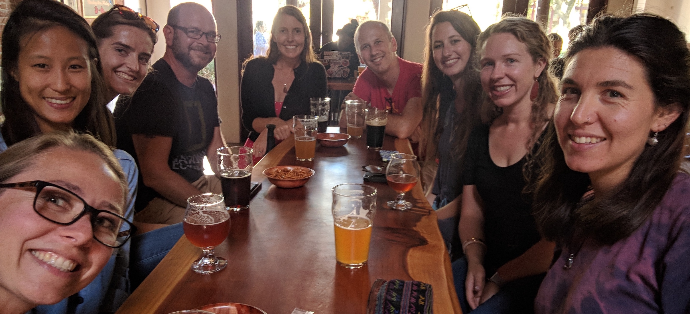

```{r setup, include=FALSE}
options(htmltools.dir.version = FALSE, warning=FALSE, message=FALSE, verbose = FALSE)
knitr::opts_chunk$set(echo = FALSE, message=FALSE, warning=FALSE)

library(xaringan)
library(fontawesome)
```


class: title-slide, right, bottom
background-image: url(img/horst-starwars-rey.png)
background-size: contain
background-position: bottom left 


# `r rmarkdown::metadata$title`

### `r rmarkdown::metadata$author`
### `r rmarkdown::metadata$role`
### `r rmarkdown::metadata$institute`

[`r icon::fa("twitter")` @juliesquid](https://twitter.com/juliesquid)  
[`r icon::fa("paper-plane")` lowndes@nceas.ucsb.edu](mailto:lowndes@nceas.ucsb.edu)  
[`r icon::fa("desktop")` jules32.github.io/useR-2019-keynote](http://jules32.github.io/useR-2019-keynote)  


???

NO UM START >> WELL

TODO LANG

Well thank you so much, I am so excited to be here with all of you and I want to thank the organizers for this invitation. 

I am a marine ecologist and R as a language and as a community has been game0changing for my science, and my life. 

So much so that over the past six years I have been moving away from doing my own research so I can pay forward what I've learned and focus on enabling other scientists to better science in less time, together. 

Throughout this I've learned several lessons, and I want to share them up front: 

---
class: inverse
# Lessons learned 
<br>

### Open data science is a mindset
### Teamwork starts with openness 
### Harness the power of welcome

???

The 3 lessons are Open data science is a mindset, Teamwork starts with openness, and Harness the power of welcome.  

I'm going to spend the whole talk building out these lessons.

But first I wanted to tell a bit about me and the main experiences that have driven these lessons. 

So let me start off when I was a graduate student in a marine research group, which we also call laboratories in the US. 

---
class: center, middle
.pull-left[
```{r sq-tag, out.width = '80%', fig.align='center'}
knitr::include_graphics("img/*IMG_9254_small_byGregAuger.jpg")  
```
]

.pull-right[
```{r sq-tag2, out.width = '80%', fig.align='center'}
knitr::include_graphics("img/*JulieReleaseAugerIMG_9311.jpg")
# *JulieReleaseAugerIMG_9397.jpg # release to water
# *IMG_9268.JPG # measure
```
]

.footnote[
photos: Greg Auger
]

???

So I am actually a squid ecologist, and my PhD research group focused on squid. These are photos from our field work at sea, studying a really incredible squid that can get nearly as big as I am. 

That is me on the right, releasing a squid back into the ocean with an electronic tag that turns it into a little oceanographer as it swam. 

---

<br>

.pull-left[
```{r fieldwork, out.width = '80%', fig.align='center'}
knitr::include_graphics("img/sq-ctd-fieldwork.JPG")  
```
]

.pull-right[
<br>
<br>
```{r fieldwork2, out.width = '100%', fig.align='center'}
knitr::include_graphics("img/DannaJulieAshleyNOAA.JPG") 
```
]

.footnote[
web: [Gilly Lab](https://gillylab.stanford.edu/)
]

???

Our research required a lot of teamwork, both at sea and in the laboratory. 

In short, we were a typical research group that collaborated around the science. 

But we didn't act like a team when it came to data. Analyzing data was something that was left to each of us to figure out as individuals.  

In in all my education I had never learned computing or how to work responsibly with data. So for me —

---
```{r luke}
```
class: center, middle
background-image: url(img/horst-starwars-luke.png)
background-size: contain

.footnote[
art: [@allison_horst](https://twitter.com/allison_horst)
]

???

For me, it meant feeling like this. 

This is Luke Skywalker after he crashed his plane in the swamp on Degobah. 

He cannot solve the the challenge in front of him with the skillsets he has. 

He is demoralized and alone. And if you imagine him attempting to use whatever pulleys and ropes he might have with him, you know it wouldn't be pretty, it wouldn't be reproducible, and it probably wouldn't get him where he needs to be on time. 

transition: but luckily what happens next is that he meets Yoda

---
class: top, center
```{r yoda, out.width = '88%'}
knitr::include_graphics("img/horst-starwars-yoda.png") 
```

.footnote[
art: [@allison_horst](https://twitter.com/allison_horst)
]

???

Yoda uses the Force to solve Luke's problem in a way Luke never imagined was possible. 

This is going to open up Luke's whole world because he can learn from Yoda and not only solve his current but it will broaden his mind to what is possible in the future. 

transition: But Luke didn't go on to defeat the Empire himself, he had a whole community.

---
```{r hands} 
```
class: center, middle
background-image: url(img/horst-starwars-hands.png)  
background-size: contain


.footnote[
art: [@allison_horst](https://twitter.com/allison_horst)
]

???

The rebel alliance is powerful because of the diversity of backgrounds and expertise, and although not everyone is a Jedi, everyone contributes in really critical ways. 

transition: So just to recap, 

---
```{r rey}
```
class: center, middle
background-image: url(img/horst-starwars-rey.png) 
background-size: contain

.footnote[
art: [@allison_horst](https://twitter.com/allison_horst)
]

???

R is the Force that enables us as scientists to do better science in less time. 

It empowers us to get our own data out of the swamp and build off of our confidence and experiences and broaden the scope of challenges that we can tackle. 

For me, I didn't fully feel this power until I finished graduate school and joined a research group where we learned to work with data as a team. 

---
```{r OHI hex, out.width = '55%', fig.align='center'}
knitr::include_graphics("img/OHI-hex.png")
```

???

The Ocean Health Index is a scientific endeavor to quantify impacts and benefits of oceans around the world using the best publically available data. 

It is being used by the United Nations and by twenty groups around the world and there is a lot more to say about it. 

But what is relevant here is that we combine lots of data and repeat our work every year, and we do it as a team.

But when we went to repeat our work, we felt like Luke 

<!---
"OHI is used by UN to try to quantify impacts and benefits" << that shuld be their takehome
--->

---
class: middle, center
```{r nature-bsilt, out.width = '100%', fig.align='center'}
knitr::include_graphics("img/nature-screenshot-title.png")
```

.footnote[
source: [Lowndes *et al.* 2017](https://www.nature.com/articles/s41559-017-0160); web: [ohi-science.org/betterscienceinlesstime](http://ohi-science.org/betterscienceinlesstime/)
]

???

Called our path to better science in less time using open data science tools. 

And this has been well received. Because a lot of scientist feel this way. 

transition: And Moz has enabled me to create a program

---
class: middle, center
```{r fig 1, out.width = '80%'}
knitr::include_graphics("img/bsilt-fig1-nature.jpg")
# lowndes-nature-figure1-slides2.png
# https://docs.google.com/drawings/d/1d25T1fD9irluhQhPvNHZSt3uUBXebxqV9hFabOLZUz4/edit
```

.footnote[
source: [Lowndes *et al.* 2017](https://www.nature.com/articles/s41559-017-0160)
]

???

and that is represented in this figure here by the circles getting smaller. 

And the axes represent how it got easier to easier to reproduce each year as well, and also it easier to collaborte with others, including our future selves, new teammembers that joined, or one of those twenty groups I mentioned. 

So you can see we made this incrementally improved how we worked over several years, and the initial impetus to do so was really tough. 

And in additional to making our science better every year, it has enabled 20 independent groups around the world to use our science and our code to study ocean health in the places they care about. 


---
class: center, middle
```{r community-logos, out.width = '100%', fig.align='center'}
knitr::include_graphics("img/ods-community-logos.png")
```

???
so many communities, people in this room and listening and around the world. 

focus on Mozilla

Spent the last year developing a program with Mozilla and NCEAS, the ecology center where I am based. 

---
```{r openscapes hex, out.width = '55%', fig.align='center'}
knitr::include_graphics("img/openscapes-hex.png")
```

.footnote[
art: [@allison_horst](https://twitter.com/allison_horst); 
web: [openscapes.org](https://openscapes.org)
]

???

Openscapes the program I developed with Mozilla and NCEAS. 

Openscapes is a mentorship program for research groups to help them establish and maintain shared practices and work as a team.

---
```{r openscapes grassland, out.width = '100%', fig.align='center'}
knitr::include_graphics("img/horst_openscapes_grassland_1500px-text.png")
```

<br>
<br>

.pull-left[
### Welcome and empower scientists as labs
]

.pull-right[
### Increase visibility and value by amplifying labs
]


.footnote[
art: [@allison_horst](https://twitter.com/allison_horst); 
web: [openscapes.org](https://openscapes.org)
]

???

welcome and empower scientists as research groups

increase visibility and valuee by amplifying labs

---
```{r openscapes desert, out.width = '100%', fig.align='center'}
knitr::include_graphics("img/horst_openscapes_desert_1500px.png")
```

<br>

.pull-left[
### Mentorship program for early career scientists & their labs
]

.pull-right[
### Normalize open data science in the lab & seed change beyond
]

.footnote[
art: [@allison_horst](https://twitter.com/allison_horst)
web: [openscapes.org/champions](https://openscapes.org/champions)
]

???

Mentorship program for early career scientists & their labs

Normalize open data science in the lab & seed change beyond

---
```{r env-r4ds}
```
class: center, middle
background-image: url(img/horst-eco-r4ds.png) 
background-size: contain

.footnote[
.left[
art: [@allison_horst](https://twitter.com/allison_horst); 
updated from [Wickham & Grolemund](https://r4ds.had.co.nz/)
]
]

???

This is the vision I see for environmental science: where the elements that environmental scientsts are great it are streeamlined together by ODS. 

Looking at the left at environmental data:  We see data in the environment and systems we study. We are great at at theory, developing hypotheses, and experimental design.

And on the right, we are getting better and better at communication and helping our findings get to the right audiences, to inform dexisions around food systems, disease transmission, sustainability, and climate change. 

And this can be streamlined with ods because tools like R because R streamlines how we work with data, and also streamlines how we work with each other. 

I know this graphic looks familiar from R4DS, but notice that all of the data science components here are ringed by communities and support. 

So this is the vision for science, amnd I am optimistic we can make this happen because I have made this transition myself, also because Openscapes participants are well on their way after only 5 months.

---
```{r env-comm}
```
class: center, middle
background-image: url(img/horst-eco-r4ds-env-comm-only.png) 
background-size: contain

.footnote[
art: [@allison_horst](https://twitter.com/allison_horst)
]

???

But right now it looks like this. We rarely have formal training and so folks learn in pockets and are unsupported at broader instituti8onal levels, but also at the level of the rsearch team.

Helping complete this picture drives my work now. 

I want to pay forward what I have learned. 

And it drives the lessons learned I shared in the beginning. 

I've found that scientists might now be aware of what tools are availabe. But that that is not really the problem. 

The problem is about mindset and feeling that open data science is somethign not only in their scientific futures, but in their scientific presents. 

So with Openscapes I work with scientists to welcome them to what this scientific present can look like for them, and I help them start paths to making it happen. Because OHI is one of the most visible examples of what this can look like, I rely heavily on it as motivition and examples, and I'll do that for the rest of the talk as well. 

---
class: inverse
# Lessons learned
<br>

### Open data science is a mindset
### Teamwork starts with openness 
### Harness the power of welcome 

???

So as I mentor scientists through Openscapes, this is how I help them engage 

<water>

---
class: inverse, center, middle
# Open data science is a mindset

### expect a better way • build confidence & willingness • reimagine science communication

???

Open data science is a mindset involves data science and open science and is creative and collaborative and fueled by what is possible with the internet. 
It's how the Force was not only a skillset but it broadened Luke's mind of what was possible and the scope of challenges he could tackle. 

And to help get into that mindset it's important to understand current mindsets and how to help reframe them. 

---
class: middle, center
# Expect there is a better way

???
TODO lang MAYBE DROP THE DATES AND FOCUS ON EXCLUDE
Expecting there is a better way to work with your data can be at odds with the mindset you have in science. 

Because as scientists, we are asking questions that no one knows the answer to. 

In my squid research, no one knew where these squid behaved in California, my data contained secrets on the forefront of discovery. So when I needed to reformat dates into ISO-15(?), this was a task completely interwoven with my squid. I did not expect that this was not something I had to do from scratch. 

Part of why I couldn't expect there was a better way is because I didn't have any idea of what was possible, and I also didn't have the vocabulary to articulate our struggles and ask for help. 

transition: so with this in mind, data science can CAN EXCLUDE SCIENTISTS
narrow interps can exclude

---
```{r data-sciencc0}
```
.whisper[Data science] 


---
```{r data-science}
```
.whisper[Data science is the discipline of turning raw data into understanding] 
  
.footnote[
source: [Wickham & Grolemund](https://r4ds.had.co.nz/)
]  
  
???

This definition resonates with me because I can see myself included in it. 

transition: And to be able to acgtually see data analysis as a graphic that has as discrete steps —

<!---
We talk about data science with this definition: that data science is the discipline of turning raw data into understanding. 

This is a definintion that resonates with environmental scientists, because we can see this as being useful in our own work. 

And this is important, because if you just read about data science in the news, you can come away with a pretty narrow defintion that it means big data, AI, and machine learning. 

And that immediately excludes many scientists who could benefit so much from what I feel data science is, a discipline concepts, theory, and tools to work with data. 

--->

---
.whisper[Data science is the discipline of turning raw data into understanding] 

<br>

```{r data-science-r4ds, out.width = '90%', fig.align='center'}
knitr::include_graphics("img/r4ds_data-science.png")
```
  
.footnote[
source: [Wickham & Grolemund](https://r4ds.had.co.nz/)
]  
  

???

that clearly describe what I have been fumbling around trying to do from scratch was so powerful. It took this burden off my shoulders and provided a framework to get to my science sooner.  

clear steps of things that every scientist does but few have articulated. 

This figure has been incredibly impactful on my life. One of my biggest challenges as a scientist was that I could not distinguish what were data challenges away from what were science challenges. PRACTICE BOTH WAYS

<The idea of tidying your data first and then being streamlined with the tools you can use for science is amazing. Rather than accommodating around weird data.

transition TODO So expecting there is a better way is a big part of this. And that is part of the mindset. 

Seeing data science as something that can be a part of your scientific present, is a huge shift in mindset. and along with it comes

---
class: middle, center
# Build confidence & willingness

???

The next is build confidence & willingness to engage in a different way to work. 

And open science is a big part of this. 

Open science has many different definitions and even more interpretations. 

For many environmental scientists, including me as a graduate student, open science is not a positive thing. 

It means people stealing my data or misstruling my science. There are softer interpretations, where it means posting data and code publically at the end of a research study when the final manuscript is published. 

In interpreations like these, there is no benefit to the individual practicing open science. There is only cost in terms of time and risk.

So it's a lot easier to just avoid it. 

///
Open science as a way to be more efficient and streamlined
Not an added ask at publication to share your data 
External memory (personal and collective)
Easier on/offboarding
Find solutions faster – learn to talk about your data
Build confidence – skills are transferable beyond your science
Be empathic and inclusive – grow a network of allies

---
```{r open-science}
```
.whisper[Open science]

???
negative thing. additional ask on overburdened scientists. 

---
```{r open-science}
```
.whisper[Open science is the concept of transparency at all stages of the research process, coupled with free and open access to data, code, and papers]

.footnote[
source: [Hampton et al. 2015](https://esajournals.onlinelibrary.wiley.com/doi/full/10.1890/ES14-00402.1)
]

???

I like this definition of open science

I teach that open science is a spectrum, with many entryways and paths to iteratively 

I like this too because it helps dispell the idea that you're either doing open science or you're not, and the activiation energy required to make that switch impossible task. 

Instead, what we talk about in Openscapes is how there are many entryways, and many ways to anticipate. 

Sharing a pdf of your presentation. Or using google slides. That is part of open science. 

OS spectrum. engage by sharing a talk online. 


---
class: center, middle
# Reimagine science communication

???

Scicomm is something we really value. 
We are very similar to the open source community like R and Moz in that all of our work is for the public good. 

So comm is very imp

For a lot of people, science communication still largely occurs at the end of a study, when everything is complete. 

And I think this mindset is rooted in the fact that for a long time, sharing your work was hard to do. 

But the internet provides amazing channels to share our work not only at the end, but throughout all of the process. This is critical to establish trust and buy-in for the results and calls to action we uncover about our environment. 

---
.whisper[Science communication tools]

???

And let me say up front that I can be a big curmudgen about introducing extra software into my life and having to create new user accounts. I remember in one NSSD episode, Roger Peng said that if he has to create a new user account, he's like 50% out. For me it's like 80. 

And why I mention that is that we can do so much of this reimagined science communication with the tools we are already using for analyses: 

But we can reimagine what this means leveraging the internet
---
.whisper[Science communication tools]

```{r ods-software, out.width = '65%', fig.align='center'}
knitr::include_graphics("img/screenshot-paur-talk-ods.png") 
```

.footnote[
source: [OHI slides](https://docs.google.com/presentation/d/12m8dUpIOz16x1RlZWLtj9u5E9wMxtYuP0T_HxoDnyKw/edit?usp=sharing)
]

???
<talk through for a moment>

So really R and GitHub are the fanciest tools we use. So it streamlines how manageable it is to focus on science communication, so let me show you a bit of what we've done

---
class: center, middle
```{r global-map, out.width = '100%'}
knitr::include_graphics("img/global_map_Index_2018_mol.png")
```

.footnote[
source: [ohi-science.org/ohi-global](http://ohi-science.org/ohi-global/)
]

???

We create ocean health index maps like these, in R, with scores reflecting how healthy oceans are for every coastal country around the world. and making these every year by modeling almost 100 data sets forces documentation and decision making to be part of science communication. 

<next go quickly>

---
class: center, middle
```{r ohi-science-github, out.width = '100%'}
knitr::include_graphics("img/github-ohi-science.png") 
```

.footnote[
web: [github.com/ohi-science](https://github.com/ohi-science)
]

???

We put all of our code online, pubically. This means that others can discover, access, and run our code, understanding what we've done and doing assessments of their own. 

But GitHub repositories are not a friendly landing page for everyone. So —

---
class: center, middle
```{r ohi-science-homepage, out.width = '100%'}
knitr::include_graphics("img/ohi-science-homepage.png") 
```

.footnote[
web (Jekyll): [ohi-science.org](http://ohi-science.org)
]


???

So we built a website that we can maintain ourselves using the same workflow that we do for our analysis, which is GitHub and friends. 

---
class: center, middle
```{r rmd-global-web, out.width = '80%', fig.align='center'}
knitr::include_graphics("img/web-rmd-global.png")
```

.footnote[
web (simple RMarkdown): [ohi-science.org/ohi-global](http://ohi-science.org/ohi-global)
]

???

We also can generate lighter-weight websites that will render with the most recent information we have

<and are also ways for our colleagues leading their own assessments>


<!---
.pull-right[
```{r blogdown-openscapes, out.width = '100%', fig.align='center'}
knitr::include_graphics("img/web-blogdown-openscapes.png") 
```

.footnote[
web (blogdown): [openscapes.org](https://openscapes.org)
]
]
--->

---
class: center, middle
```{r toolbox-training, out.width = '80%'}
knitr::include_graphics("img/ohi-toolbox-training.png")
```

.footnote[
web: [ohi-science.org/toolbox-training](http://ohi-science.org/toolbox-training/)
]

???

Another way science communication has changed is that we can create really nicely formatted guides and documentation also using these same tools. 

---
<br>
```{r shiny-ne, out.width = '100%', fig.align='center'}
knitr::include_graphics("img/jafflerbach-shiny-ne.png") 
```

.footnote[
dashboard (Shiny): [@jafflerbach](https://twitter.com/jafflerbach), work in progress. 
inspiration: [Imagine Boston](https://analytics.boston.gov/app/imagine-boston) 
]

???

And when we are working closely with partners who are engaged with data analysis decisions, we have been able to create dashboards as well. 

<!---

# open source science
```{r bhi, out.width = '50%', fig.align='center'}
knitr::include_graphics("img/bhi_map_Index.png") 
```

.footnote[
web: [ohi-science.org](http://ohi-science.org/projects/ohi-assessments/)
]

???

but most importantly we have been making science open source. 
where folks can build directly off our science and off our code. 

this is the dream, and we've been doing our best to nuture this going forward. The Baltic is one of nearly twenty independent groups building off of OHI science and code to leae

--->

---
class: inverse, center, middle
# Open data science is a mindset

### expect a better way • build confidence & willingness • reimagine science communication

---
```{r r4ds-env-reprise}
```
class: center, middle
background-image: url(img/horst-eco-r4ds.png) 
background-size: contain

.footnote[
.left[
<br>
art: [@allison_horst](https://twitter.com/allison_horst);
updated from [Wickham & Grolemund](https://r4ds.had.co.nz/)
]
]

---
class: inverse, center, middle
# Teamwork starts with openness
### working openly • vertical & horizontal leadership • community

???

///
in our calls, I try to model the behavior i want to see, so that they can bring it to their labs. their homework is to have specific meetings in their labs, and start to seed this culture more broadly 

Evseteryone is starting from didfferent places, so progress differs, and outcomes differ. Someone might start using github for the first time. Or google drive. Some might start a #tidytuesday coding club or 

right after Nature: When i say ODS, I mean these tools i have in mind. It is R and...


Setup lessons: i'm going to walk through these points saying how either I or OHI experiencee them, and then what the Openscapes champions have done. 

///


Teams to me means rings of people you respect, collaborate with, and can rely upon. It does not have to be limited to a certain deliverable, location, discipline or anything else. 

Teamwork is critical in science because no one it can do it all. and for the sake for innovation as well as for emotional well-being. And that is because no one can do it all, and we need to shed the expectation that we should. 

There are some blurred lines here but one of the cooles things to me is how teamwork and collaboration and leadership and community all intertwine when you work openly. 

---
# Ocean Health Index team
 
```{r team, out.width = '100%', fig.align='center'}
 
```

???

transition: but something that this figure does not reflect is how much being effective as a team was critical for this transition. 


---
# Openscapes Champions

```{r champions-web, out.width = '70%', fig.align='center'}
knitr::include_graphics("img/openscapes-summit-web-champions.png")
```

.footnote[
blog: [openscapes.org](https://www.openscapes.org/blog/2019/03/27/champions-incorporate-open-science/)
]
???

I've worked with 7 different research groups, that are led by these awesome scientists. 

They do cutting edge work on global food systems, human health ecology dajfdlk and teaching the next generation of environmental masters students. 

They are early career faculty and lecturers and I call them Champions because their main responsibility is to <safe spacses TODO. champion open data science and become visible and vocal support.

---
# Openscapes Cohorts
```{r zoom, out.width = '70%', fig.align='center'}
knitr::include_graphics("img/Cohort1_zoom.png") 
```

.footnote[
blog: [openscapes.org](https://www.openscapes.org/blog/2019/01/28/introducing-champions-program/)
]

???

And here they are, all together and with their lab members, who are graduate students, postdocs, technicians, lab managers, visiting faculty. 

We all meet twice each month to discuss open data science concepts and to build community as we try weaving these practices into our every day work. 

Lab members are responsible for planning out more hands-on work <TODO>

transition: I've framed what we talk about with those lessons learned. 

---
class: center, middle
# Working openly

???

Critical to learn something new together. 

We work really openly with each other. We co-develop things, we share early drafts, and we are constantly giving feedback and iterating with each other. 

What is it? it's about feeling the tension and finding the balance 

---
# Working openly

.pull-left[
### trust
### respect & kindness
### imperfection & vulnerability
### asking for & accepting help
]

--

.pull-right[
<br>
<br>
.whisper[happy teams]<br>
.whisper[innovation]<br>
.whisper[resilience]
]

???

These can be hard. On on individual level, it can take some soul searching. But critical for a team. There is mindset involved here too.

trust & assuming best intentions

respecting each other's time.

innovation & learn from failure

it's about resilience and avoiding burnout

transition: one of the ways to start working on this as a team is to create safe spaces where you can deliberately talk about shared stuff.


---
# Lab culture
<br>
### Code of Conduct
### Onboarding
### Seaside Chats 
### Lab Hackathons


???

Thnk about this in terms of individuals and tone they set as a team

deliberate

It's about thinking what Future You might need but also what Future Us might need. 

coopted the idea of hackathons, where we will all drop our own projects and come together for a day or an afternoon to do something that will benefit the whole group. but is no one's responsibility directly

So this is where we will actually overhaul our filepath conventions or refactor and modernize all our code with dplyr instead of plyr. 

In both seaside chats and hackathons we've also developed written protocols for onboarding new teammembers so that they can get upskilled and in our workflow as soon as possible.

With Openscapes, we've discussed doing hackathons to put data in one place and write data dictionaries and metadata.

So a few examples of what Champions have done here: 

- Wood lab seaside chats

- Pinsky lab CoC and cookbook

- Nina pathway


transition: one final thing that we do as an OHI team, and that is critical, is that we prioritize social time


transition: So this is all critical to operating like a team and being able to engage effectively and collaboratlively with ODS

And this team culture was ignited and nurtured by really supportive leadership.

<!---https://twitter.com/juliesquid/status/793515652719882240 felted octocats --->

---
class: center, middle
# Vertical & horizontal leadership

???

Leadesrhip is imp vert and horiz

---
class: center, middle
.pull-left[
```{r halpern, out.width = '100%', fig.align='center'}
knitr::include_graphics("img/Halpern-UCSB_UCOP-30.jpg")
```

.footnote[
web: [National Center for Ecological Analysis & Synthesis](https://www.nceas.ucsb.edu/)
]
]

.pull-right[
```{r shiny-laughing, out.width = '100%', fig.align='center'}
knitr::include_graphics("img/shiny-conf-2016-crop.jpeg")
# knitr::include_graphics("img/tweet-juliesquid-shinydevcon2016.png")
```

.footnote[
tweet: [@juliesquid](https://twitter.com/juliesquid/status/693324555704610816)
]
]

???

TODO Lang see below


This is Ben Halpern, he's the lead of OHI and also the director of NCEAS, the ecology center where we are based. 

He set this tone for our team, and has played a huge role in our data science even though he is not a coder himself. 

And this is really critical. 

As a leader he listened to our excitement and he supported us to invest time and resources in open data science, and he trusted us to implement shared practices for our team.

He's making environmental data science a priority at NCEAS, and has also spearheaded a new masters program in environmental science at the University of California 

transition: so with Openscapes, I also mentor the research group leads individually so that they can become champions for open data science and have an oversized influence like Ben has had. 

////


We all had agency and support to become leaders within our lab group, and beyond. 

This is Ben Best, Jamie Afflerbach and me. They are my teammates but they have also been  leaders for me. Ben spent countless hours sitting with me and teaching me R and was patient when I deliberately made emails from github go to my spam folder because I thought GitHub was not going to be useful to me. 

And Jamie is an amazing leader as well, I'll tell a story about her in a moment. 

And together we are partners in crime. We cofounded EDS with other friends and have taught multiple carpentries workshops together. This is us preparing for the Shiny conference in 2016. 

transition: Enabling this kind of leadership within teams is what I try to ignite with Openscapes. 

---
```{r zoom-michelle, out.width = '80%', fig.align='center'}
knitr::include_graphics("img/Cohort1_zoom-michelle.png") 
```

.footnote[
twitter: [stuart620](https://twitter.com/stuart620)
]

???

And Michelle Stuart is an excellent example. She is actually here at useR, where is she?
 
She is in the Pinsky lab and spearheads their seaside chats. She made a GitHub account during one of our Openscapes calls and then helped others in the lab do so as well. 

So she has become not only become a leader within the Pinsky Lab, she has become a lead in the broader community. 

transiton: So it is fine time that we talk about community.  

---
class: center, middle
# Community

???

Open data science communities are online and in person, and they break down boundaries between traditional disciplines.

I used to have my feet squarely in the marine science community, but now I feel like a bridge across environemtnal science, R community and the Mozilla communities. 

I've learn so much from each and try to help channel those lessons between groups.
 
transition: And engaging in these broader communities for me started on Twitter.
 
---
# \#rstats
```{r jafflerbach, out.width = '45%', fig.align='center'}
knitr::include_graphics("img/tweet-juliesquid-jafflerbachspatial.png") 
```

.footer[
tweet: [@juliesquid](https://twitter.com/juliesquid/status/728326585485402112)
]

???

My teammate Jamie encouraged to join twitter to learn R. 

I was definitely skeptical. I did not use Twitter because I thought it was a megaphone for angry people. 

But she taught me how to use it to to listen and learn from other others. And then to gradually build up the courage to like and retweet things. 

And that this was not only a way to become part of the community yourself, but it was a way to welcome and amplify other people who might be unsure of what they were doing too.  

So I was amazed that you could have community on Twitter

---
```{r ropensci, out.width = '70%', fig.align='center'}
knitr::include_graphics("img/tweet-jcheng-leaflet.png") 
```
 
.footer[
tweet: [@jcheng](https://twitter.com/jcheng/status/611260382741577729)
]

???

And I was also amazed that developers were real people. And not only that, they were super nice people that made me feel welcome and valued even as I was doing, there, or in life more generally

Prior to these conversations, I had never stopped to think that there were real people behind software. 

transition: And I don't think that's entirely my fault, because before twitter, this is the closest I'd ever come:

---
class:middle, inverse, center
```{r clippy}
```


<!--- --->
???

transition: Seriously, I'm not kidding. 

But realizing that software developers went well beyond Clippy here was really a defining point in my life. 

This is was that turning point when I really became the person I am today — that person who never stops talking about how awesome R is and how it will change your life

So it's good that somethings haven't changed. 

transition: but even back in 2016 my 4 year old niece knew that Hadley Wickham was wizard who lived on the internet

---
class: center, middle
```{r out.width = '100%'}
knitr::include_graphics("img/tweet-juliesquid-wizard.png")
# https://twitter.com/juliesquid/status/726521325821431808
```

.footnote[
tweet: [@juliesquid](https://twitter.com/juliesquid/status/726521325821431808)
]

???

transition: 

---
# rOpenSci & RStudio

.pull-left[
```{r out.width = '70%', fig.align='center'}
knitr::include_graphics("img/tweet-jafflerbach-runconf15.png") 
```

.footnote[
tweet: [@jafflerbach](https://twitter.com/jafflerbach/status/581578558977368064) 
]
]

.pull-right[
```{r out.width = '82%', fig.align='center'}
knitr::include_graphics("img/tweet-juliesquid-shinydevcon-2016.png") 
```

.footnote[
tweet: [@juliesquid](https://twitter.com/juliesquid/status/694237930991161344)
]

]

???

So, rOpenSci and RStudio. I'm deliberately limiting myself by putting them on the same slide here because I could talk about both of them. 

They have been so supportive and welcoming fromt the get go. And it was so exctiging to be able to particitae in unconfs and dev conferences

They have created communities where developers and new users who are strangers become collabortors and friends and where there is deliberate attention to setting the right space to make that happen. 

It was a big deal to not only connect online, but also in person, with so many other people in these communiies. It really solidified that we were part of this. And I wanted Openscapes to have this same opportunity

---
background-image: url(img/openscapes-summit.jpg)  
background-size: contain

.footnote[
blog: [openscapes summit](https://www.openscapes.org/blog/2019/04/08/summit-reflections1/)
]

???

So midway through the Openscapes program, we were able to get the research leads together in person in California. 

Not only this give them an opportunity to meet each other as scientists who are engaging in open data science, but we tried replicate what I have experienced at rOpenSci and RStudio conferences and we included Sean from the R community and Christie Bahlai from the Mozilla community. 

So I had high expections about how awesome this would be but they were exceeeded. 

Up to this point they understood that all of this was powerful and they knew I was really excited about it, but they left the summit actually feeling it for themselves. 

---
class: middle
.whisper[This isn’t just about coding and GitHub, this is about changing how we do science <br>— Malin Pinsky (Pinsky Lab)]

???

transition: so moving forward I really want to be able to have these cohort meetups during the Openscapes program

There are many more communities that I love but I'm going to talk about one more right now, and that's RLadies

---
class: centere, middle
.pull-left[
```{r halley-rnoaa, out.width = '100%', fig.align='center'}
knitr::include_graphics("img/halley-rnoaa-tweet.png")  
```
 
.footnote[
tweet: [@DocFroehlich](https://twitter.com/DocFroehlich/status/1085990833571020800)
]

]

.pull-right[
```{r adrian-cowplot, out.width = '100%', fig.align='center'}
knitr::include_graphics("img/tweet-adrianstier-cowplot.png")
```

.footnote[
tweet: [@adrianstier](https://twitter.com/AdrianStier/status/1113486371631403010)
]
]

---
# RLadies
```{r rladies, out.width = '100%', fig.align='center'}
knitr::include_graphics("img/rladies-rstudioconf19-jdlong.jpg")  
```
 
.footnote[
web: [rladies.org](https://rladies.org/), 
photo: [JD Long](https://twitter.com/CMastication/status/1101568109423542273)
]

???

RLadies is changing the world, starting off by increasing gender diverstity in the R community. 

And so when we talk about this in Openscapes, it's not only to encourage scientists to become a part of RLadies, but to kicks-start this kind of movement in science. 

RLadies as a global program and as so many individual has given given me confidence in myself, and made me be a better advocate for women in science. 

And along with Michelle you I already told you about we are seeing this now with the Openscapes scientists too:


---
exclude: TRUE
# Carpentries workshops

.pull-left[
```{r swc-xhoi, out.width = '100%', fig.align='center'}
knitr::include_graphics("img/swc-whoi-2018b.jpg") 
```
]

.pull-right[
```{r swc-mbari, out.width = '100%', fig.align='center'}
knitr::include_graphics("img/swc-mbari.jpg")
```
]

<!---
others:
https://twitter.com/jafflerbach/status/936371169107746816 mbari
https://twitter.com/jafflerbach/status/721006698937225216 ucsb
--->

.footnote[
TODO links
]


???

i learned how to teach ODS by becoming an instructor with the Carpentries. Not only did they teach me what to teach, they taught me how to teach and how people learn. 

---
# Eco-Data-Science & RLadies SB
<br> 

.pull-left[
```{r eds, out.width = '100%', fig.align='center'}
knitr::include_graphics("img/swc-ucsb-2016-crop.jpeg")  
```
 
.footnote[
web: [eco-data-science.github.io](http://eco-data-science.github.io/)
]

]

.pull-right[
```{r rladiessbb, out.width = '100%', fig.align='center'}
knitr::include_graphics("img/rladiessb-kickoff2019.jpg")
# rladies-kickoff.jpg
```

.footnote[
tweet: [@RLadiesSB](https://twitter.com/RLadiesSB/status/1088825797085880320)
]
]

???
<TODO add hexes?>

we lead one locally, complements our coding club

And I helped create local communities in California so we could shate what we knew and learn from others

---
class: center, middle
```{r michelle-rladies, out.width = '82%'}
knitr::include_graphics("img/tweet-stuart620-rladies.png") 
```

.footnote[
tweet: [@RLadiesHPNJ](https://twitter.com/RLadiesHPNJ/status/1139867491822383104)
]


---
class: center, middle
```{r allison-tidytuesday, out.width = '82%'}
knitr::include_graphics("img/tweet-allison_horst-tidytuesday.png") 
```

.footnote[
tweet: [@allison_horst](https://twitter.com/allison_horst/status/1110242520833769472); blog [openscapes.org](https://www.openscapes.org/blog/2019/05/02/tidy-tuesday-coding-club/)
]

???

You probably recognize her name from all the beautiful artwork in this talk


---
class: center, middle
```{r allisonhorst-github-io, out.width = '60%'}
knitr::include_graphics("img/allisonhorst-github-io.png")
knitr::include_graphics("img/allisonhorst-github-io2.png")
```
 
.footnote[
web: [allisonhorst.github.io](https://allisonhorst.github.io/) 
]

???
TODO clip screenshot to read course names

TODO lang
But she is also a lecturer of data science and statistics at the University of California, in an environmental science and management program. Around 100 students leave their masters program having learned from her each year, and through Openscapes she has upgraded her course materials to now include tidyverse and GitHub and created this website to post everything online. 

Her position is one of the only ones I know of, but we need people like Allison is every environmental science department

---
class: inverse, center, middle
#  Teamwork starts with openness 
### working openly • vertical & horizontal leadership • community
???

So we've spent the bulk of time in this teamwork section, and is because it is so critical to learning. TODO

transition: The more I reflect on this the more I realized is that —

---
class: middle, center
```{r loop, out.width = '100%'}
knitr::include_graphics("img/horst-lowndes-loop.png")
```

.footnote[
art: [@allison_horst](https://twitter.com/allison_horst)   
]

???

data science and teamwork exist together in a feedback loop that streamlines how we work and innovate. 

Learning and using similar software promotes and streamlines teammwork. And also working as a team better equips you to learn open practices data science.

You really need both. Trying to engage solely with open data science without teamwork can be lonely and deflating. And only as a team but without the best collaborative software can be inefficient.

transition: This is a loop that feeds back on itself. For me, and likely for a lot of us in this room, this becomes difficult to differentiate and tease apart. 

---

```{r hex-wall-oz, out.width = '70%', fig.align='center'}
knitr::include_graphics("img/useR-oz-hex-wall.jpg") 
```

.footnote[
tweet: [@dataandme](https://twitter.com/dataandme/status/1017117835821244416)
]

???

https://twitter.com/sharlagelfand/status/1103792867145859073
 pic TODO
I mean, just look at our hex stickers, which are a combination of tools and communities


---
class: middle, center
```{r loop2, out.width = '100%'}
knitr::include_graphics("img/horst-lowndes-loop.png")
```

.footnote[
art: [@allison_horst](https://twitter.com/allison_horst)   
]

???

TODO

So it took our Ocean Health Index team 4 years to learn how to work as a team and use open data science tools. 

That's too long. That's too long for anyone but especially too long when we are already living with impacts of climate change. 

Openscapes is designed to reduce that time by identifying entry points and welcoming scientists into <this loop>

And notice that this is not about "getting" scientists to do this — it is about welcoming them. 

transition: Because welcome is a powerful thing.

---
class:inverse, center, middle
# Harness the power of welcome

???

Welcome is a powerful thing because it is so simple: it means being nice to people. 

It means being empathetic, realizing that even though  someone might be an expert in their field and doing amazing science, they but might be intimidated by open data science and you can welcome them. 

---
<br>
<br>
```{r value-welcome, out.width = '90%', fig.align='center'}
knitr::include_graphics("img/ropensci-butland-welcome.png")
```

.footnote[
blog: [ropensci](https://ropensci.org/blog/2017/07/18/value-of-welcome/)
]

???

I learned this early from the folks at rOpenSci, RStudio and RLadies with their commitment to creating diverse and inclusive spaces. 

And it has been a big part of my experience and education with Mozilla, and a foundational part of Openscapes.


---
```{r welcome-rstats, out.width = '75%', fig.align='center'}
knitr::include_graphics("img/horst-welcome_to_rstats_twitter.png")
```

.footnote[
art: [@allison_horst](https://twitter.com/allison_horst);
blog: [openscapes.org](https://www.openscapes.org/blog/2019/01/15/personify-code/)
]

???

transition: Welcome people with smiles, with emojis, and with body language

---
<br>
```{r pacman, out.width = '50%', fig.align='center'}
knitr::include_graphics("img/rstudioconf-tweet-er.png") 
```

.footnote[
tweet: [@robinson_es](https://twitter.com/robinson_es/status/1085917956033392641); 
blog: [openscapes.org](https://openscapes.org/2019/02/19/rstudioconf)
]

???

The PacMan rule is that you are chatting in a group, you leave space for someone to join. 

And this is a great thing that we can all practice at this conference too. 


---
class: inverse
# Lessons learned  
<br>

### Open data science is a mindset
> expect a better way • build confidence & willingness • reimagine science communication

### Teamwork starts with openness
> working openly • vertical & horizontal & leadership • community

### Harness the power of welcome 

???

So these lessons I think fuel what it means to work responsibly and collaboratively with data but should also fuel what it means to do science. 

we've just through are definitionly a work in progress. 

As is Openscapess. I am continuing to develop and grow the program, with plans to lead annual cohorts online and also do short-form workshops with teams on the ground. I want this to be a self-sustaining model, so please get in touch if you have any ideas. 

Because I do think that Openscapes helps us get closer to —

---
```{r openscapes-arctic, out.width = '100%', fig.align='center'}
knitr::include_graphics("img/horst_openscapes_arctic_1500px.png")
```

<br>
<br>

.pull-left[
### Mindset shifts in individuals<br>Increase in skills & practice

]

.pull-right[
### Culture shifts in labs<br>Leadership & championing

]


.footnote[
art: [@allison_horst](https://twitter.com/allison_horst); 
web: [openscapes.org](https://openscapes.org)
]


???

---
```{r closing-thoughts}
```
name: environ-comm-r4ds
class: center, middle
background-image: url(img/horst-eco-r4ds.png) 
background-size: contain

.footnote[
.left[
<br>
art: [@allison_horst](https://twitter.com/allison_horst);
updated from [Wickham & Grolemund](https://r4ds.had.co.nz/)
]
]

???

This, since they ajfldkajfd, then create the same thing in their labs, and in their departments, their campuses, and beyond. 

BUT TODO

And I am confident that they see the benefit more, but the biggest obstacle is TIME especially since investing time in not part of what people are evaluated on as scientists. 

But I hvae lofty goals that by increating the visibility of these practices with these Champions, we can increase the value in environmental science as well. 

And that there will be more support from institutions and universities to teach this formally. because Openscapes is not the ultimate solution, it's a bandaid. 

But..

What’s been challenging and what we’re still working on as a more collaborative community.

---
```{r hands} 
```
class: center, middle
background-image: url(img/horst-starwars-hands.png)  
background-size: contain

.footnote[
art: [@allison_horst](https://twitter.com/allison_horst)
]

???

And the awesome thing is that we all have our part to play in helping this change. . 

a critical thing is that anyone can step up and be a leader. 

And the easiest/fastest way is to welcome.

And if you yourself are unsure you have a team or feel like you're on the outside of the feedback loop or on the threshold, know that since you're here so you're already part of it. 
BOMMER ENDING SENTENCE

in a time when env sci is our most pressing probs are related to env it's critical that those scientits have the tools and team to answer those quiestions using data.

<!--- Memorize this and tempo. And what I'm offering as part of the solution. 

One of final slides
"this is powerful for science" >>> it's part of this for science. but it's also powerful for people. mental health, leaky pipeline, burnout. and maybe include this too. This is really powerful for science and individuals and teams. 

--->

---
# Thank you 


OHI team  
Mozilla team  
Openscapes Champion Labs
RLadies team

<br>

all artwork: [@allison_horst](https://twitter.com/allison_horst)  
xaringan theme: [@apreshill](https://github.com/apreshill/talks/blob/master/uo-sad-plot-better/index.Rmd#L7)

.pull-right[
.whisper[Find me for stickers...]
<br>
 
]

???

These teams that have given me such support and feedback

I want to end by saying thank you to this community for so many things, but particurly to its leadership in creating a diverse and inclusive space. I have learned so much about the importance of diverse and inclusive spaces, and this is an area that I in particular want to help extend these aspects of our culture to the environmental science community, and well beyond. 

Thank you.

---
```{r fin}
```
class: title-slide, right, bottom
background-image: url(img/horst-starwars-rey.png)
background-size: contain
background-position: bottom left   


# `r rmarkdown::metadata$title`

### `r rmarkdown::metadata$author`
### `r rmarkdown::metadata$role`
### `r rmarkdown::metadata$institute`

[`r icon::fa("twitter")` @juliesquid](https://twitter.com/juliesquid)  
[`r icon::fa("paper-plane")` lowndes@nceas.ucsb.edu](mailto:lowndes@nceas.ucsb.edu)  
[`r icon::fa("desktop")` jules32.github.io/user-2019-keynote](http://jules32.github.io/user-2019-keynote)  


